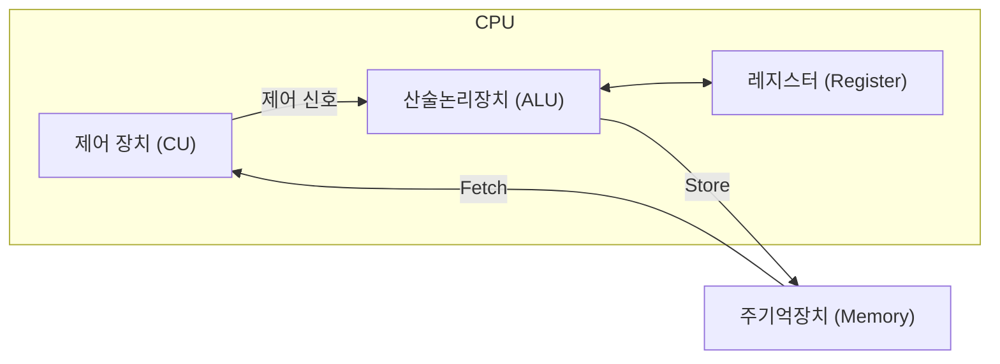
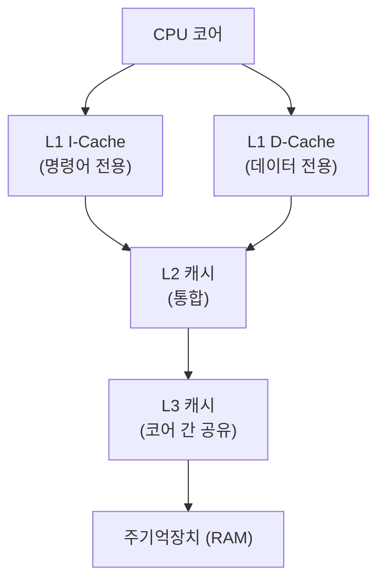
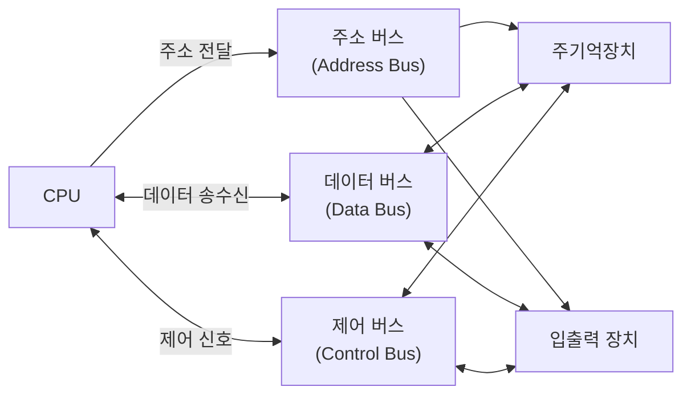
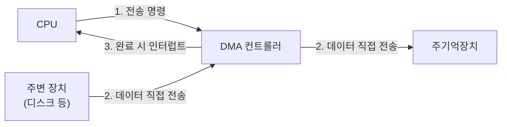

#운영체제


1. [[#컴퓨터 시스템 개요|컴퓨터 시스템 개요]]
	1. [[#컴퓨터 시스템 개요#컴퓨터 시스템 개념|컴퓨터 시스템 개념]]
	2. [[#컴퓨터 시스템 개요#동작 원리 및 구조|동작 원리 및 구조]]
2. [[#프로세서(Processor, CPU)|프로세서(Processor, CPU)]]
	1. [[#프로세서(Processor, CPU)#프로세서 개념|프로세서 개념]]
	2. [[#프로세서(Processor, CPU)#프로세서 동작 원리와 내부 구조|프로세서 동작 원리와 내부 구조]]
3. [[#메인 메모리|메인 메모리]]
	1. [[#메인 메모리#메인 메모리 개념|메인 메모리 개념]]
	2. [[#메인 메모리#메인 메모리 동작 원리 / 구조|메인 메모리 동작 원리 / 구조]]
4. [[#캐시Cache|캐시Cache]]
	1. [[#캐시Cache#캐시 개념|캐시 개념]]
	2. [[#캐시Cache#캐시 동작 원리와 구조|캐시 동작 원리와 구조]]
		1. [[#캐시 동작 원리와 구조#캐시 질문들|캐시 질문들]]
			1. [[#캐시 질문들#I-Cache, D-Cache에 데이터가 나뉘는 시점|I-Cache, D-Cache에 데이터가 나뉘는 시점]]
			2. [[#캐시 질문들#각 캐시는 데이터를 복사해서 저장하는가?|각 캐시는 데이터를 복사해서 저장하는가?]]
			3. [[#캐시 질문들#L1, L2 캐시는 코어마다 있는가?|L1, L2 캐시는 코어마다 있는가?]]
			4. [[#캐시 질문들#캐시의 "용량"과 "캐시 라인"의 차이|캐시의 "용량"과 "캐시 라인"의 차이]]
			5. [[#캐시 질문들#L1 캐시의 용량 관련|L1 캐시의 용량 관련]]
5. [[#시스템 버스|시스템 버스]]
	1. [[#시스템 버스#시스템 버스 개념|시스템 버스 개념]]
	2. [[#시스템 버스#시스템 버스 동작 원리 및 구조|시스템 버스 동작 원리 및 구조]]
	3. [[#시스템 버스#시스템 버스 비교표|시스템 버스 비교표]]
	4. [[#시스템 버스#시스템 버스 시각화|시스템 버스 시각화]]
	5. [[#시스템 버스#시스템 버스 관련 개념 - 간단히만 알아두기|시스템 버스 관련 개념 - 간단히만 알아두기]]
6. [[#주변 장치Peripheral Devices|주변 장치Peripheral Devices]]
	1. [[#주변 장치Peripheral Devices#주변 장치 개념|주변 장치 개념]]
	2. [[#주변 장치Peripheral Devices#주변 장치의 동작 원리와 구조|주변 장치의 동작 원리와 구조]]
7. [[#생각해 볼 질문|생각해 볼 질문]]
8. [[#면접 핵심 정리|면접 핵심 정리]]

## 컴퓨터 시스템 개요

### 컴퓨터 시스템 개념
- 컴퓨터 시스템 = 하드웨어 + 소프트웨어
- CPU 혼자서는 아무것도 못 한다. 메모리에서 명령을 가져오고, 버스로 데이터를 옮기고, 주변 장치와 입출력을 주고 받아야 실제 프로그램이 동작한다.
- **명령이 어떻게 흘러가는가**를 이해하는 게 핵심. 

### 동작 원리 및 구조
- `폰 노이만 구조` 기준으로 보면 시스템은 크게 4가지로 나뉜다.
	- **프로세서(Processor / CPU)** : 명령을 해석하고 실행
	- **주기억장치(Main Memory)** : 실행 중인 프로그램과 데이터를 저장
	- **입출력 장치(I/O Devices)** : 외부와 데이터를 주고받음
	- **시스템 버스(System Bus)** : 위 세 요소를 연결하는 통로

- 프로그램 실행의 기본 흐름
	1. **Fetch** : 메모리에서 명령을 가져옴
	2. **Decode** : CPU에서 해석
	3. **Execute** : 실행
	4. **Store** : 필요하면 메모리나 I/O에 결과를 씀
	- 위 사이클이 반복되는 것이 프로그램이 동작한다는 의미다.

- 폰 노이만 구조의 핵심 특징 
	- **저장 프로그램 방식(Stored Program Concept)** : 명령어(Instruction)와 데이터(Data)를 같은 메모리 공간에 함께 저장해 프로그램을 데이터처럼 메모리에 적재하고 실행 가능

- 다른 구조도 있다.
	- 하버드 구조 
		- 명령어 메모리와 데이터 메모리를 물리적으로 분리해 별도의 버스로 접근함
		- 장점 : 명령어 fetch와 데이터 접근을 동시에 할 수 있어서 속도가 빠르다(병목이 줄어듦)
		- 단점 : 메모리 공간이 고정적으로 나뉘어 있어 프로그램, 데이터 비율에 따라 유연하게 쓸 수 없고 구조가 더 복잡하다.
		- 사용처 : 마이크로컨트롤러, DSP, 임베디드 칩 등 속도가 중요하고 메모리 크기가 정해진 환경
	- **수정된 하버드 구조** 
		- 메모리 자체는 하나지만(폰 노이만과 동일), **캐시 단계에서 명령어 캐시와 데이터 캐시를 분리**
		- 폰 노이만의 유연함과 하버드의 속도를 절충한 형태다. 
		- 일반 PC/스마트폰 CPU(x86, ARM)가 대부분 이 방식을 쓴다. 

>[!question]
>AI의 답변 중, 일반 PC는 폰 노이만 구조도 쓰고 수정된 하버드 구조도 쓴다고 했다. 뭐가 맞는 말임?
- 일반 PC는 두 구조를 층위가 다르게 동시에 쓴다.
	- **메모리 레벨은 폰 노이만 구조**를 쓴다.
		- RAM 하나에 명령어와 데이터가 함께 저장된다.
		- 주소 공간도 같은 걸 쓴다.
	- **캐시 레벨에서는 수정된 하버드 구조**
		- CPU, 메모리 사이에 있는 L1 캐시만 명령어 캐시(I-Cache)와 데이터 캐시(D-Cache)로 물리적으로 분리
		- CPU 입장에서는 분리된 캐시를 통해 명령어와 데이터를 동시에 가져올 수 있어 속도상 이득을 본다. 
	- **메모리에는 둘이 함께 저장되지만, 가져올 때는 각 캐시에서 따로 가져온다는 개념**이다. 그래서 같은 사이클에서 둘을 모두 가져올 수 있는, 병렬성을 확보한다.
		- 한꺼번에 캐시로 가져와서 분리시키는 게 아님. (내가 이렇게 오해했으므로 주의)

## 프로세서(Processor, CPU)

### 프로세서 개념
- 명령어를 해석하고 실행하는 컴퓨터 시스템의 핵심 연산 장치.
- 필요한 이유 : 메모리는 데이터를 저장만 할 뿐 스스로 계산하거나 판단하지 못한다. 명령어를 실제로 `해석Decode`하고 `계산Execute`할 주체가 필요하다. 

### 프로세서 동작 원리와 내부 구조
- CPU의 구성
	- **제어 장치(Control Unit, CU)**
		- 명령어를 해석하고 각 부품(ALU, 메모리 I/O)에 무엇을 할지 신호를 보내는 역할.
		- 직접 계산하지 않고, 순서와 신호만 관리한다. 사람으로 치면 지휘자.
	- **산술논리장치(Arithmetic Logic Unit, ALU)**
		- 실제 덧셈, 뺄셈 등의 `산술 연산`과 AND/OR/비교 `논리 연산`을 수행하는 부품
	- **레지스터(Register)**
		- CPU 내부의 아주 작고 빠른 임시 저장 공간.
		- 연산에 필요한 값만 잠깐 담아둔다. RAM보다 훨씬 빠르나 매우 작은 용량.

- 기본 실행 사이클(Fetch - Decode - Execute Cycle)
	1. `Fetch(인출)`
		- 메모리에서 다음 실행할 명령어를 가져온다.
		- `PC(Program Counter)`라는 레지스터가 다음에 가져올 명령어의 주소를 가리키고 있다.
	2. `Decode(해석)`
		- 제어 장치에서 그 명령어가 무슨 연산인지 해석한다.
	3. `Execute(실행)`
		- ALU가 실제 연산을 수행하거나, 메모리 / 레지스터에 읽고 씀.
	4. 1번부터 다시 반복.



- 코드로 보는 예제 - 실제 CPU 동작은 아니고 명령을 하나씩 읽어서 실행한다는 개념만 보는 예제
```cs
int[] program = { 1, 5, 3 }; // 명령어: 1=더하기, 5와 3=피연산자 역할로 단순화
int pc = 0; // Program Counter 역할

int opcode = program[pc++]; // Fetch
int a = program[pc++];
int b = program[pc++];

if (opcode == 1) // Decode
{
    int result = a + b; // Execute (ALU 역할)
    Console.WriteLine(result); // 8
}
```

- 유니티에서의 예시
	- CLR(공용 언어 런타임)이 C# 코드를 실행할 때도, 결국 최종적으로는 JIT 컴파일된 기계어가 CPU에서 Fetch - Decode - Execute 사이클을 걸쳐 실행되는 것
	- `Update()` 같은 콜백이 매 프레임 호출되는 것도 결국 그 안의 코드가 CPU에서 명령어 단위로 순차실행되는 것이다.
		- 단, "프레임" 개념은 `Unity` 엔진 레벨에서의 스케줄링이지 CPU의 Fetch - Decode - Execute 사이클과는 다른 층위다.

## 메인 메모리

### 메인 메모리 개념
- CPU가 직접 접근해서 읽고 쓸 수 있는 저장 공간. 흔히 RAM을 가리킨다.
- 왜 필요함? : CPU 레지스터는 너무 작아서 프로그램 전체와 데이터를 담을 수 없다. 실행 중인 명령어와 그 프로그램이 다루는 데이터를 담아둘 더 큰 공간이 필요하다.
- 보조기억장치와의 차이 : 보조기억장치는 용량은 크나, CPU가 직접 접근하지 못하고 느리다. 실행하려면 반드시 주기억장치로 가져와야 한다. 

### 메인 메모리 동작 원리 / 구조
- 주기억장치는 `주소Address` 단위로 접근한다. 
	- 저장 칸(보통 1바이트)마다 고유한 주소가 새겨져 있고 CPU는 이 주소를 통해 원하는 위치를 읽거나 쓴다.
- `랜덤 접근(Random Address)`
	- 어떤 주소든 접근하는 데 걸리는 시간이 동일하다. 임의의 위치에 바로 접근할 수 있어서 `Random Access Memory`이다.
	- 순서대로 처음부터 읽어야 하는 `테이프 방식`과 다름.
	- `휘발성Volatile` : 전원이 꺼지면 저장된 내용이 사라진다. 프로그램은 실행 전에 보조기억장치에서 주기억장치로 `적재Load`되어야 한다.

- 보조기억장치와의 비교

| 개념              | 특징                   | 장점             | 단점                  | 사용 예               |
| --------------- | -------------------- | -------------- | ------------------- | ------------------ |
| 주기억장치(RAM)      | CPU에서 직접 접근, 휘발성     | 빠름, 임의 접근      | 용량 대비 비쌈, 전원 꺼지면 소실 | 실행 중인 프로그램, 데이터 저장 |
| 보조기억장치(HDD/SSD) | CPU에서 직접 접근 불가, 비휘발성 | 대용량, 저렴, 영구 저장 | 상대적으로 느림            | 파일, 실행 파일 영구 저장    |
- 둘의 차이가 생기는 이유
	- RAM은 빠른 접근을 위해 상대적으로 비싼 반도체 기술을 씀
	- 보조기억장치는 대용량, 저비용을 위해 다른 저장 방식(자기 디스크, 플래시)을 씀

- 유니티, C#에서의 접근
	- `int x = 5;`는 주기억장치 어딘가에 저장된다.
	- 단, **`C# / CLR` 레벨에서는 이 주소를 직접 다루지 않고 `GC`가 관리**한다. 메모리 주소에 저장된다는 개념은 OS/하드웨어 공통이나, 그 **주소를 누가 관리하느냐는 언어/런타임마다 다르다.** 
		- C# : GC
		- C: 프로그래머가 직접

## 캐시Cache
### 캐시 개념
- CPU와 주기억장치 사이에 위치한, 자주 쓰는 데이터를 임시로 담아두는 초고속 저장 공간
- 왜 필요한가 
	- CPU 속도는 계속 빨라져왔는데, 주기억장치 접근 속도는 상대적으로 느리다. 
	- `병목Bottleneck` : CPU가 매번 RAM까지 왕복하면 CPU가 노는 타이밍이 발생함
	- **CPU와 RAM 사이의 속도 차이를 메워줄 중간 저장소 역할**을 한다. 

### 캐시 동작 원리와 구조
- `지역성 원리(Locality of Reference)`
	- `시간적 지역성(Temporal Locality)` : 최근 접근한 데이터는 곧 다시 접근할 가능성이 높음 (예 - 반복문 내의 변수)
	- `공간적 지역성(Spatial Locality)` : 접근한 데이터 근처의 주소도 곧 접근될 가능성이 높음 (예 - 배열 순회)
	- 두 지역성 덕분에 자주 쓰는 것만 미리 가까이 갖다 두면 실제로 적중률이 높다.

- `캐시 히트(Cache Hit) / 캐시 미스(Cache Miss)`
	- CPU가 데이터를 요청함 
		- 캐시에 있으면 바로 Hit(즉시 반환, 빠름) 
		- 없으면 Miss(주기억장치에 다녀와야 함, 느림, 가져온 데이터를 캐시에 채움)
	- [[CPU 캐시 적중률(Cache Hit Rate)|캐시 적중률]]도 참고. 비슷한 내용이다.

- `다단계 캐시(Multi-level Cache)`
	- L1 -> L2 -> L3 순으로 존재한다.
	- CPU는 L1 -> L2 -> L3 -> 주기억장치 순으로 탐색함.

| 개념    | 특징                                                | 장점         | 단점               | 사용 예           |
| ----- | ------------------------------------------------- | ---------- | ---------------- | -------------- |
| L1 캐시 | CPU 코어에 가장 근접. I-Cache / D-Cache가 분리된 형태(수정된 하버드) | 가장 빠름      | 가장 용량이 작음(수십 kB) | 매 명령어 / 데이터 접근 |
| L2 캐시 | L1보다 멀리, 통합된 경우 많음                                | L1보다 큼     | L1보다 느림          | L1 미스 시        |
| L3 캐시 | 코어 간 공유, 가장 큼                                     | 용량 큼(수 MB) | 가장 느림(캐시 중에서)    | L2 미스 시        |
- 차이가 생기는 이유 
	- 물리적으로 CPU 코어에 가까울수록 회로가 빠르나, 그만큼 자리(공간)를 많이 못 쓴다. 

- 시각화


- 지역성 코드 예시 
	- 행 우선 순회 vs 열 우선 순회 중, 행 우선 순회가 빠르다. 
	- 열 우선 순회는 띄엄띄엄 떨어져 있는 데이터들을 오가기 때문.

- 유니티 / C#에서의 접근
	- 대량의 오브젝트를 다룰 때 배열/리스트를 순차적으로 접근하도록 설계하면 캐시 친화적이라 성능이 잘 나온다. `DOTS(Data-Oriented Techonology Stack)`의 ECS가 이 원리를 적극 활용하는 대표적인 예시. 
	- 단, 이는 지역성 원리를 활용한 설계일 뿐 캐시 자체를 유니티나 C# 코드가 직접 제어하는 건 아니다. 하드웨어가 알아서 채우는 것이고 개발자는 그 하드웨어가 잘 동작하도록 메모리 접근 패턴만 신경쓰는 것.

#### 캐시 질문들
- 캐시 관련해선 유독 질문이 많았다.

##### I-Cache, D-Cache에 데이터가 나뉘는 시점
- CPU가 명령어를 요청하는 상황을 예로 들면
	1. CPU 안에는 **명령어를 가져오는 유닛인 `Fetch Unit`과 데이터를 읽고 쓰는 유닛인 `Load/Store Unit`이 따로 있어서, 이 둘이 각자 독립적으로 요청을 보낸다.**
	2. `Fetch Unit`이 주소의 명령어를 달라고 하면, `L1 I-Cache`부터 확인한다.
		- `Hit` 시 CPU로 바로 전달, 끝.
		- `Miss` 시 `L2`로 요청 전달.
	3. `L2`는 명령어/데이터를 구분하지 않는 `통합 캐시Unified Cache`로, 여기 있으면 그 데이터 블록을 `L1 I-Cache`로 채워넣고 CPU에 전달.
	4. 없다면 이후는 RAM까지 요청이 전달됨.
	5. RAM에서 데이터를 가져왔다면, L3 -> L2 -> L1에 데이터를 채우면서 올라간다.
	- `D-Cache`의 동작도 동일.

- 따라서,
1. `요구 기반 캐싱Demand Fetching`
	- 요청받기 전까지, RAM에서는 아무 것도 보내지 않음. (예측 기법이 있긴 한데 여기선 몰라도 됨)
2. 명령어 캐시 / 데이터 캐시로 갈지 여부는 L1 단계에서만 나뉜다. **CPU 코어에서 어떤 유닛이 요청했느냐에 따라 자동으로 갈리는 것.**
3. L2, L3에서는 메모리처럼 하나의 블록으로 저장해둔다. 

##### 각 캐시는 데이터를 복사해서 저장하는가?
- **RAM에 다녀온 데이터는 L1, L2, L3 전부에 동시에 존재**하게 된다.
	- 상위 레벨(L1)의 캐시가 하위 캐시(L2, L3)의 데이터를 항상 포함하는 방식을 `포함 캐시InClusive Cache`라고 한다. 
	- 모든 CPU에서 쓰이는 방식은 아니다. `배타 캐시Exclusive Cache`라는, 같은 데이터를 여러 단계에 중복 저장하지 않고 한 곳에만 두는 방식도 쓴다. 근데 이건 제조사마다 다른 얘기니까 적당히 넘겨도 됨.

##### L1, L2 캐시는 코어마다 있는가?
- **L1, L2 캐시 : 코어 전용(Private)** - 다른 코어에서 볼 수 없음
- L3 캐시 : 여러 코어 공유(Shared) - 한 CPU 칩 안의 모든 코어가 같은 L3을 나눠 씀.

- 왜 나눴는가?
	- L1, L2는 코어 바로 옆에 붙어있어야 빨라서 코어마다 물리적으로 따로 둠
	- L3는 코어 간에 데이터를 공유해야 할 때(멀티스레드 상황 - 코어 A가 쓴 데이터를 코어 B도 써야 하는 상황) 매 번 RAM까지 안 가고 L3에서 주고받을 수 있게 해주는 역할도 한다.

##### 캐시의 "용량"과 "캐시 라인"의 차이
- L1, L2, L3 캐시의 용량이 다르지만, **캐시 라인의 크기(64바이트)는 전부 동일하다.**
- **셋의 차이는 64바이트짜리 칸을 담을 공간이 몇 개나 있느냐**이다.

- L1 : 칸이 적음(예 : 총 32KB - 64byte 서랍 512개)
- L2 : 칸이 더 많음(예 : 총 512KB -> 서랍 약 8000개)
- L3 : 칸이 훨씬 많음(예 : 총 8MB -> 서랍 약 13만개)

- 이렇게 생각하면 캐시의 용량은 생각보다 클지도? 

##### L1 캐시의 용량 관련
- 예시인 32KB라고 한다면, 총량을 나눠 갖는 개념이 아니라 `I-Cache 32KB + D-Cache 32KB`이다. 
- 물리적으로 완전히 분리되었기에, 하나가 부족하다고 다른 쪽 공간을 빌려쓰지는 않는다.

## 시스템 버스

### 시스템 버스 개념
- CPU, 메모리, 입출력 장치 등 컴퓨터 시스템의 구성 요소들을 서로 연결해 데이터를 주고 받는 연결 통로.
- 왜 필요한가 : 
	- CPU, 메모리, I/O 장치를 서로 하나하나 개별 선으로 연결하면 부품이 늘어날수록 배선이 기하급수적으로 늘어난다. 
	- **하나의 공용 통로를 만들고 필요한 쪽이 통로를 빌려 쓰는 편이 효율적**이다.

### 시스템 버스 동작 원리 및 구조
- 역할에 따라 세 종류로 나뉘고, 물리적으로는 이 셋이 함께 하나의 버스 다발을 이룬다.

- **주소 버스(Address Bus)**
	- 어디에 접근할지 주소 정보를 전달.
	- 단방향 (CPU -> 메모리/장치)
	- 버스의 비트 폭이 접근 가능한 최대 주소 범위를 결정(32bit -> 4GB)
- **데이터 버스(Data Bus)**
	- 실제 주고받을 데이터가 흐르는 통로
	- 양방향 (읽기 : 메모리 -> CPU / 쓰기 : CPU -> 메모리)
	- 버스 폭이 넓을수록 한 번에 더 많은 데이터를 옮길 수 있음(64bit 데이터 버스 -> 한 번에 8바이트)
- **제어 버스(Control Bus)**
	- "읽기 / 쓰기"인지, "언제 데이터가 준비됐는지" 등의 제어 신호를 전달.
	- 양방향 - CPU가 명령을 보내기도 하고, 장치가 상태를 CPU에 알리기도 한다.

- 동작 예시
	1. CPU가 **주소 버스**에 읽고 싶은 메모리 주소를 실음
	2. CPU가 **제어 버스**에 `읽기Read` 신호를 보냄
	3. 메모리가 해당 주소의 데이터를 **데이터 버스**에 실어서 응답
	4. CPU가 데이터 버스에서 값을 읽어감

### 시스템 버스 비교표

| 개념     | 특징            | 방향             | 사용 예                  |
| ------ | ------------- | -------------- | --------------------- |
| 주소 버스  | 접근 위치 지정      | 단방향(CPU -> 외부) | 메모리 / 장치 주소 지정        |
| 데이터 버스 | 실제 데이터 전달     | 양방향            | 읽기 / 쓰기 데이터 이동        |
| 제어 버스  | 타이밍, 명령 신호 전달 | 양방향            | Read/Write, 인터럽트 신호 등 |
- 역할을 나눈 이유 - 어디에(주소) / 무엇을(데이터) / 어떻게(제어) 라는 서로 다른 성격의 정보를 한 통로에 섞어 보내면 해석이 복잡해지니, 역할별로 통로를 분리해둔 것.

### 시스템 버스 시각화


### 시스템 버스 관련 개념 - 간단히만 알아두기
- **버스 대역폭 (Bus Bandwidth)**
	- 버스가 단위 시간당 옮길 수 있는 데이터량.
	- 버스 폭(비트 수)과 동작 속도(클럭)에 비례.
- **버스 중재 (Bus Arbitration)**
	- 여러 장치가 동시에 버스를 쓰려고 할 때 누가 먼저 쓸지 정하는 매커니즘.
	- 공용 통로이므로 발생하는 문제. 여기선 이런 게 있다 정도만 언급.

- 유니티 / C#에서는 직접 다룰 일은 없다.
- "버스 대역폭이 성능 병목이 될 수 있다"는 개념은 GPU - CPU 간의 데이터 전송을 다룰 떄 비슷한 맥락으로 다시 나올 수 있다. 

>[!question]
>- OS에 표시되는 비트 수가 정확히 의미하는 바는? 
>	- 사전 예상
>		- 기본적으로 알고 있던 건 포인터가 가리킬 수 있는 메모리 주소의 총 갯수
>		- 여기서는 주소 버스가 비슷한 역할일 거라고 생각.
>		- 데이터 버스는 데이터의 용량 얘기이므로 해당되지 않을 듯?

**32 / 64bit OS**가 가리키는 건 **CPU 레지스터 크기 = 포인터 크기(가상 주소 공간)** 이다. 주소 버스와 개념적으로 연결됐지만, 실제 핀 갯수와 완전히 같은 건 아니다.

- **OS 비트 수는 CPU가 한 번에 다룰 수 있는 주소값의 비트 수(레지스터 폭)를 의미한다. 이는 곧, 포인터 하나의 크기이자 이론상 표현 가능한 최대 주소 공간**(2^64)이다. 
- 예전 CPU는 레지스터 폭 = 실제 주소 버스 핀 갯수가 거의 일치해서 OS 비트 수 = 주소 버스 폭이라는 이해가 꽤 정확했지만, 현대의 `x86-64`같은 CPU는 레지스터/포인터는 64비트지만, 실제 물리 주소 버스 핀은 보통 40~48비트 정도만 쓴다.
	- 64비트가 표현할 수 있는 용량이 `TB` 단위인데, **램을 `TB` 단위로 꽂을 일이 없으니 물리 주소 버스에 `64bit`를 다 배선하는 게 낭비라서 일부만 연결**한 것.
- 데이터 버스의 폭은 처리량의 문제이므로, OS 비트 수와 연결되는 문제는 아니다. 


## 주변 장치Peripheral Devices

### 주변 장치 개념
- CPU, 메모리 외부에서 시스템과 정보를 주고받는 **입출력(I/O) 장치들의 총칭**
	- 키보드, 마우스, 모니터, 디스크, 네트워크 카드 등
- 왜 필요함? : **CPU, 메모리 만으로는 외부 세계와 상호작용할 수 없다.** 사람의 입력을 받거나, 결과를 화면에 보여주거나, 데이터를 영구 저장 하거나 등등등.

### 주변 장치의 동작 원리와 구조
- CPU가 주변 장치와 데이터를 주고 받는 방식은 크게 2가지.

1. **프로그램에 의한 I/O (Programmed I/O)**
	- CPU가 직접 장치 상태를 계속 `확인(Polling)`하면서 데이터를 주고받는 방식.
	- 장치가 준비될 때까지 CPU가 계속 물어봐야 해서 CPU 자원을 낭비함.

2. **인터럽트 기반 I/O (Interrupt-Driven I/O)**
	- CPU가 매번 확인하지 않고, **장치가 준비되면 인터럽트(Interrupt) 신호**를 보내 CPU에게 알림.
	- CPU는 다른 작업을 하다가 인터럽트가 오면 하던 일을 멈추고 처리한 뒤, 원래 작업으로 복귀.
	- Programmed I/O보다 CPU를 효율적으로 씀.

3) **DMA(Direct Memory Access)**
	- 대용량 데이터를 옮길 때, CPU를 거치지 않고 DMA 컨트롤러가 장치와 메모리 사이를 직접 연결해서 데이터를 옮김.
	- CPU는 옮기라는 지시만 하고, 옮기는 작업이 끝나면 인터럽트로 통보받음. 그 사이에 CPU는 다른 일을 할 수 있음. 


| 개념                   | 특징                     | 장점                | 단점               | 사용 예                   |
| -------------------- | ---------------------- | ----------------- | ---------------- | ---------------------- |
| Programmed I/O       | CPU가 계속 상태 확인(Polling) | 구현 단순             | CPU 자원 낭비        | 아주 단순하거나 저속인 장치        |
| Interrupt-Driven I/O | 장치가 준비되면 CPU에 알림       | CPU 효율적 사용        | 인터럽트 처리 오버헤드 존재  | 키보드, 마우스 등 저빈도 입력      |
| DMA                  | 컨트롤러가 CPU 없이 직접 전송     | 대용량 전송에 CPU 부담 없음 | DMA 컨트롤러 하드웨어 필요 | 디스크, 네트워크 카드 등 대용량 I/O |

- 장치의 데이터 발생 빈도와 전송량에 따라 최적 방식이 다르다. 


- 유니티 / C#
	- C#의 비동기 파일 I/O(`File.ReadAllTextAsync`)나 네트워크 I/O는 OS 레벨에서 인터럽트 기반/DMA 방식의 I/O 위에서 동작. CPU가 I/O 완료를 기다리며 멈춰있지 않고 다른 작업을 할 수 있다는 점에서 인터럽트 방식과 개념적으로 닿아 있다. 
	- C#의 `async/await`는 언어, 런타임 레벨의 비동기 처리 모델로, 하드웨어의 인터럽트/DMA와는 다른 층위다. 
		- OS/하드웨어가 CPU를 붙잡는 방식과 C# 코드가 스레드를 안 붙잡는 방식은 비슷한 철학이나 구현 방식은 완전히 다름에 유의.

## 생각해 볼 질문

1. **폰 노이만 구조에서 저장 프로그램 방식이 의미하는 것은?**
	- 명령어와 데이터를 같은 메모리 공간에 저장한다. 프로그램도 데이터처럼 적재한다.

2. **폰 노이만 구조와 수정된 하버드 구조는 어느 층위에서 차이가 나는가?**
	- 수정된 하버드 구조는 L1 캐시를 `D-Cache(데이터 캐시)`와 `I-Cache(명령어 캐시)`로 구분한다. 차이가 나는 층위는 L1 캐시 레벨.

3. **캐시가 효과 있는 이유의 근거?**
	- 시간적 지역성(최근 접근한 데이터는 곧바로 다시 쓸 가능성이 높음)
	- 공간적 지역성(접근한 데이터 근처의 데이터에 접근할 가능성이 높음)
	- 이들을 위해 메모리에서 데이터를 가져올 때 필요한 데이터만 가져오지 않고 근처의 데이터를 캐시 라인의 크기만큼 함께 가져온다.

4. L1, L2, L3 캐시는 왜 속도와 용량이 반비례하는가?
	- L1, L2 캐시는 코어 근처에 물리적으로 붙어 있음. 
	- L3 캐시는 여러 코어가 공유하므로 상대적으로 떨어져 있음.

5. 주소, 데이터, 제어 버스는 각각 무엇을 담당하는가?
	- 주소 버스 : 데이터의 위치
	- 데이터 버스 : 데이터 자체
	- 제어 버스 : 제어 신호 전달 

6. OS의 32/64비트는 어떤 개념과 연결되는가?
	- CPU 레지스터 크기 = 포인터가 갖는 주소 공간의 갯수(2^32, 2^64)
	- 주소 버스의 경우 32비트 시절에는 주소의 갯수만큼 사용했는데, 64비트로 오면서 수 TB에 해당하는 램을 쓸 일이 없어서 주소 버스의 일부만 연결해서 쓰고 있음.

7. 인터럽트 기반의 I/O와 DMA는 각각 언제 유리한가?
	- 인터럽트는 저빈도(사람의 입력 등), DMA는 고빈도(디스크 I/O).

8. 대용량 파일을 디스크에서 읽을 때 왜 CPU가 직접 옮기지 않는가?
	- 인터럽트 기반으로 처리하면 CPU가 작업을 못 함(계속 하던 일을 중단하고 인터럽트 항목을 처리해야 하므로 작업의 속도가 떨어지기 때문.)
	- 그래서 별도의 DMA 컨트롤러를 두고 CPU는 옮기라는 명령만 컨트롤러에 내리며, 작업이 끝나면 인터럽트 형태로 CPU에게 전달된다.

## 면접 핵심 정리

- **폰 노이만 구조**: 명령어·데이터를 같은 메모리에 저장하는 저장 프로그램 방식. 현대 컴퓨터의 기본 구조
- **Fetch-Decode-Execute 사이클**: CPU가 명령어를 가져와 해석·실행하는 반복 과정
- **캐시**: CPU-메모리 속도 차를 메우는 고속 저장소. 지역성 원리 기반, 캐시 라인 단위로 복사되며 L1은 코어별 I/D 분리, L2는 코어별, L3는 코어 간 공유가 일반적
- **시스템 버스**: 주소/데이터/제어 버스로 역할 분리된 공용 통신 통로
- **I/O 방식**: Polling → Interrupt → DMA 순으로 CPU 개입이 줄어드는 방향으로 발전


- **자주 나오는 질문 예시**
- Q. "캐시 계층 구조(L1/L2/L3)가 왜 필요한가요?"
    - A. CPU 속도와 메모리 접근 속도의 차이를 메우기 위해서입니다. L1은 코어에 가장 가까워 가장 빠르지만 용량이 작고, L2, L3로 갈수록 코어에서 멀어지는 대신 더 많은 데이터를 담을 수 있습니다. CPU는 L1부터 순서대로 확인하며, 자주 쓰는 데이터일수록 상위 캐시에 남아있을 가능성이 높아 전체적으로 평균 접근 속도가 빨라집니다.
- Q. "인터럽트 기반 I/O와 DMA의 차이는 무엇인가요?"
    - A. 인터럽트 기반 I/O는 장치가 준비되면 CPU에 신호를 보내 처리하게 하지만, 실제 데이터 전송 자체는 여전히 CPU가 담당합니다. 반면 DMA는 별도의 DMA 컨트롤러가 CPU 개입 없이 장치와 메모리 사이의 데이터 전송을 직접 처리하고, 전송이 끝났을 때만 인터럽트로 CPU에 알립니다. 그래서 디스크처럼 대용량 데이터를 옮길 때는 DMA가 CPU 부담을 훨씬 줄여줍니다.