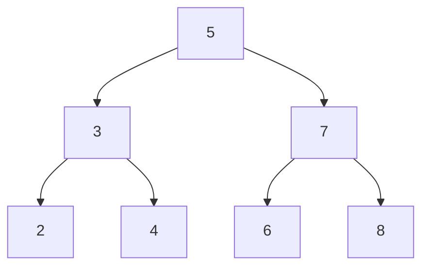

1. [[#정렬의 이해|정렬의 이해]]
	1. [[#정렬의 이해#정렬 개념|정렬 개념]]
	2. [[#정렬의 이해#정렬 분류|정렬 분류]]
2. [[#선택 정렬|선택 정렬]]
	1. [[#선택 정렬#선택 정렬 이해|선택 정렬 이해]]
	2. [[#선택 정렬#선택 정렬 알고리즘|선택 정렬 알고리즘]]
	3. [[#선택 정렬#선택 정렬 프로그램|선택 정렬 프로그램]]
		1. [[#선택 정렬 프로그램#선택 정렬 예제|선택 정렬 예제]]
3. [[#버블 정렬|버블 정렬]]
	1. [[#버블 정렬#버블 정렬 이해|버블 정렬 이해]]
	2. [[#버블 정렬#버블 정렬 알고리즘|버블 정렬 알고리즘]]
	3. [[#버블 정렬#버블 정렬 프로그램|버블 정렬 프로그램]]
		1. [[#버블 정렬 프로그램#버블 정렬 예제|버블 정렬 예제]]
4. [[#퀵 정렬|퀵 정렬]]
	1. [[#퀵 정렬#퀵 정렬 이해|퀵 정렬 이해]]
	2. [[#퀵 정렬#퀵 정렬 알고리즘|퀵 정렬 알고리즘]]
	3. [[#퀵 정렬#퀵 정렬 프로그램|퀵 정렬 프로그램]]
		1. [[#퀵 정렬 프로그램#퀵 정렬 예제|퀵 정렬 예제]]
5. [[#삽입 정렬|삽입 정렬]]
	1. [[#삽입 정렬#삽입 정렬 이해|삽입 정렬 이해]]
	2. [[#삽입 정렬#삽입 정렬 알고리즘|삽입 정렬 알고리즘]]
	3. [[#삽입 정렬#삽입 정렬 프로그램|삽입 정렬 프로그램]]
		1. [[#삽입 정렬 프로그램#삽입 정렬 예제|삽입 정렬 예제]]
6. [[#셸 정렬|셸 정렬]]
	1. [[#셸 정렬#이해|이해]]
	2. [[#셸 정렬#알고리즘|알고리즘]]
	3. [[#셸 정렬#셸 정렬 프로그램|셸 정렬 프로그램]]
		1. [[#셸 정렬 프로그램#셸 정렬 예제|셸 정렬 예제]]
7. [[#병합 정렬|병합 정렬]]
	1. [[#병합 정렬#병합 정렬 이해|병합 정렬 이해]]
	2. [[#병합 정렬#병합 정렬 알고리즘|병합 정렬 알고리즘]]
	3. [[#병합 정렬#병합 정렬 프로그램|병합 정렬 프로그램]]
		1. [[#병합 정렬 프로그램#병합 정렬 예제|병합 정렬 예제]]
8. [[#카운팅 정렬|카운팅 정렬]]
	1. [[#카운팅 정렬#카운팅 정렬 이해|카운팅 정렬 이해]]
	2. [[#카운팅 정렬#카운팅 정렬 핵심 아이디어|카운팅 정렬 핵심 아이디어]]
		1. [[#카운팅 정렬 핵심 아이디어#단계별로 보기|단계별로 보기]]
9. [[#기수 정렬|기수 정렬]]
	1. [[#기수 정렬#기수 정렬 이해|기수 정렬 이해]]
	2. [[#기수 정렬#기수 정렬 알고리즘|기수 정렬 알고리즘]]
	3. [[#기수 정렬#기수 정렬 프로그램|기수 정렬 프로그램]]
		1. [[#기수 정렬 프로그램#기수 정렬 예제|기수 정렬 예제]]
10. [[#힙 정렬|힙 정렬]]
	1. [[#힙 정렬#힙 정렬 이해|힙 정렬 이해]]
	2. [[#힙 정렬#힙 정렬 알고리즘|힙 정렬 알고리즘]]
	3. [[#힙 정렬#힙 정렬 구현|힙 정렬 구현]]
		1. [[#힙 정렬 구현#힙 정렬 예제|힙 정렬 예제]]
11. [[#트리 정렬|트리 정렬]]
	1. [[#트리 정렬#트리 정렬 이해|트리 정렬 이해]]
	2. [[#트리 정렬#트리 정렬 알고리즘|트리 정렬 알고리즘]]
	3. [[#트리 정렬#트리 정렬 프로그램|트리 정렬 프로그램]]
		1. [[#트리 정렬 프로그램#트리 정렬 예제|트리 정렬 예제]]
12. [[#정렬 알고리즘 시간 복잡도, 공간 복잡도 정리|정렬 알고리즘 시간 복잡도, 공간 복잡도 정리]]
13. [[#생각해 볼 만한 질문들|생각해 볼 만한 질문들]]


## 정렬의 이해

### 정렬 개념
- 데이터가 섞여 있을 때, 원하는 값을 찾기 위해서는 처음부터 끝까지 다 훑어야 한다.
- 정렬이 되어 있어야 빠른 탐색이 가능하다.

- 정의 : 데이터 집합을 특정 기준(오름차순 / 내림차순)에 따라 순서대로 재배열하는 것.
### 정렬 분류
- **내부 정렬 vs 외부 정렬** 
	- 내부 : 데이터가 메모리에 다 올라감
	- 외부 : 디스크를 오가며 처리해야 함

- **비교 기반 여부**
	- 비교 기반 O : 원소끼리 대소를 비교하며 정렬
	- 비교 기반 X : 값의 자릿수 등을 이용해 비교 없이 분류

- **안정 vs 불안정** 
	- 값이 같은 두 원소의 순서가 정렬 후에도 유지되는지

- **제자리 정렬(in-place) 여부**
	- 제자리 O : 추가 메모리 없이 원본 배열 안에서 정렬이 끝남
	- 제자리 X : 별도 공간이 필요함

## 선택 정렬

### 선택 정렬 이해
- 아직 정렬되지 않은 부분에서 가장 작은 값을 찾아 맨 앞으로 보내는 것을 반복함.
- **매번 비교**하며, **교환(swap)은 한 회전(pass) 당 한 번**만 일어난다.
### 선택 정렬 알고리즘
1. 정렬되지 않은 구간(최초 : 배열 전체)에서 최솟값의 위치를 찾는다.
2. 그 최솟값을 정렬되지 않은 구간의 맨 앞 원소와 교환한다.
3. 정렬된 구간이 하나 늘어난 것으로 보고, 남은 구간에 대해 1, 2를 반복한다.
4. 정렬되지 않은 구간이 원소 1개만 남으면 종료한다.

### 선택 정렬 프로그램
```cs
// 선택 정렬 : 매 회전마다 최솟값을 찾아 앞으로 보낸다.
public static void SelectionSort(int[] arr)
{
	for (int i = 0; i < arr.Length - 1; i++)
	{
		int minIndex = i;
		for (int j = i + 1; j < arr.Length; j++)
		{
			if (arr[j] < arr[minIndex])
				minIndex = j;
		}
		// 내부 루프가 다 끝난 후에 교환
		(arr[i], arr[minIndex] = (arr[minIndex], arr[i]));
	}
}
```
- 교환하는 부분은 [[Csharp - 튜플 분해|튜플 분해]] 참고. 
- 시간 복잡도 : 항상 $O(n^2)$
	- 이미 정렬되어 있어도 비교는 그대로 다 해야 한다. 
	- 비교 횟수 : `n(n-1) / 2`
	- 교환 횟수 : 최대 `n-1`
	- **비교는 항상 최대, 교환은 항상 최소**다.
#### 선택 정렬 예제
`[5, 4, 2, 1]`이라는 배열이 있다고 하면

| 회전(i) | 탐색 구간        | 찾은 최솟값   | 교환 후 배열              |
| ----- | ------------ | -------- | -------------------- |
| 0     | [5, 4, 2, 1] | 1(인덱스 3) | [**1**, 4, 2, **5**] |
| 1     | [4, 2, 5]    | 2(인덱스 2) | [1, **2**, **4**, 5] |
| 2     | [4, 5]       | 4(인덱스 2) | [1, 2, 4, 5]         |
| 3     | [5]          | 5(인덱스 3) | [1, 2, 4, 5]         |
> 볼드는 발생한 교환 인덱스들

- 0번 인덱스부터 하나씩 진행하면서 배열 전체에서 가장 작은 값을 하나씩 바꿔나가는 방식이다.
- 한 번의 회전마다 최솟값이 앞부터 하나씩 놓인다.

## 버블 정렬

### 버블 정렬 이해
- 인접한 두 원소를 계속 비교해서 순서가 틀리면 그 자리에서 바로 교환하는 방식. 
	- 큰 거품이 위로 떠오르듯 매 회전마다 최댓값이 뒤로 밀린다고 해서 버블 정렬이다.
- 선택 정렬과 비교 : "비교할 때마다" 교환이 일어날 수 있다.

### 버블 정렬 알고리즘
1. 배열의 첫 원소부터 시작, 인접한 두 원소 `arr[j]`, `arr[j+1]`를 비교한다.
2. 앞이 뒤보다 크면 두 원소를 교환한다.
3. 배열 끝까지 이 과정을 반복하면, 한 회전이 끝날 때마다 정렬되지 않은 구간에서 가장 큰 값이 맨 뒤로 확정된다.
4. 정렬된 구간(뒤쪽)을 하나씩 늘려나가며 위 과정을 반복, 한 회전 동안 교환이 없었다면 이미 정렬된 것이므로 조기 종료한다.

### 버블 정렬 프로그램
```cs
// 버블 정렬 : 인접한 두 원소를 비교하며 큰 값을 뒤로 밀어낸다
public static void BubbleSort(int[] arr)
{
	for (int i = 0; i < arr.Length - 1; i++)
	{
		bool swapped = false;
		
		// 이미 정렬된 뒷쪽은 비교할 필요 없음
		for (int j = 0; j < arr.Length - 1 - i; j++)
		{
			if (arr[j] > arr[j + 1])
			{
				(arr[j], arr[j + 1]) = (arr[j + 1], arr[j]);
				swapped = true;
			}
		}
		
		// 한 회전 동안 교환이 없었다면 정렬 완료이므로 조기 종료
		if (!swapped) break; 
	}
}
```
- 내부 조건문 `arr.Length - 1 - i`는 **맨 뒤에서부터 인덱스를 하나씩 제외하는 개념**이다. 
	- 위에서 `j = i + 1`부터 시작하는 것과 완전히 같은 개념임. 뒤에서 오는 것 뿐이다.
- 조기 종료를 넣으면 이미 정렬된 배열에 대해서도 $n^2$번 비교하는 걸 막을 수 있다. 
	- 최선의 경우 $O(n)$까지 개선할 수 있음.
- 시간 복잡도 
	- 최악 / 평균 $O(n^2)$이나, 
	- 조기 종료 덕분에 이미 정렬된 최선의 경우 $O(n)$으로 구현 가능.
- 선택 정렬과 비교
	- 선택 정렬 : 비교 $O(n^2)$ , 교환 $n -1$ 고정
	- 버블 정렬 : 비교할 때마다 교환이 일어날 수 있어 최악의 케이스에서 $O(n^2)$ 
	- 일반적으로 버블 정렬이 더 느리다고 알려져 있다.
- 안정 정렬이다.
	- 같은 값끼리는 인접 비교에서 교환이 일어나지 않으므로 (`>=`이 아님) 원래 순서가 유지된다.

#### 버블 정렬 예제
- `[5, 4, 2, 1]`을 오름차순 정렬한다.

| 회전 i | 비교 / 교환 과정      | 회전 후 배열              |
| ---- | --------------- | -------------------- |
| 0    | `j = 0` : 5 > 4 | [**4**, **5**, 2, 1] |
|      | `j = 1` : 5 > 2 | [4, **2,** **5**, 1] |
|      | `j = 2` : 5 > 1 | [4, 2, **1**, **5**] |
| 1    | `j = 0` : 4 > 2 | [**2**, **4**, 1, 5] |
|      | `j = 1` : 4 > 1 | [2, **1**, **4**, 5] |
| 2    | `j = 0` : 2 > 1 | [**1**, **2**, 4, 5] |

## 퀵 정렬

### 퀵 정렬 이해
- 기준값(피벗)보다 작은 건 왼쪽, 큰 건 오른쪽으로 나누는 걸 반복하는 `분할 정복(Divide And Conquer)` 방식
- 선택 / 버블 정렬은 한 번에 원소 하나씩만 제자리를 잡아갔으나, 퀵 정렬은 **매 단계마다 배열을 절반 가까이 통째로 나누기 때문에 평균적으로 훨씬 빠르다.** 

### 퀵 정렬 알고리즘 
1. 배열에서 피벗을 하나 고른다.(마지막 원소를 피벗으로 사용함)
2. `partition` : 피벗보다 작은 원소는 왼쪽, 큰 원소는 오른쪽으로 오도록 배열을 두 구간으로 나눈다. 이 과정 후, 피벗은 자기 자리를 찾아 확정된다.
3. 피벗을 기준으로 나뉜 왼쪽과 오른쪽 구간에 대해 재귀적으로 1, 2를 반복한다.
4. 구간의 원소 개수가 1개 이하가 되면 재귀를 멈춘다.
### 퀵 정렬 프로그램
```cs
// 퀵 정렬 : 피벗을 기준으로 분할하고, 각 구간을 재귀적으로 정렬
public static void QuickSort(int[] arr, int low, int high)
{
	if (low >= high) return; // 구간의 원소가 1개 이하인 조건
	
	int pivotIndex = Partition(arr, low, high);
	QuickSort(arr, low, pivotIndex - 1); // 피벗 왼쪽
	QucikSort(arr, pivotIndex + 1, high); // 피벗 오른쪽
}

// 마지막 원소를 피벗으로 삼아 작은 값은 왼쪽, 큰 값은 오른쪽으로 정렬.
public static int Partition(int[] arr, int low, int high)
{
	int pivot = arr[high];
	int i = low - 1; // 피벗보다 작은 값들 집합의 마지막 위치
	
	for (int j = low; j < high; j++)
	{
		if (arr[j] < pivot)
		{
			i++;
			(arr[i], arr[j]) = (arr[j], arr[i]);
		}
	}
	
	// 피벗을 작은 값 구간 바로 다음 위치로 이동시켜서 확정
	(arr[i + 1], arr[high]) = (arr[high], arr[i + 1]);
	return i + 1;
}
```
- `Partition`이 반환하는 `pivotIndex`는 피벗이 최종적으로 자리 잡은 위치다. 이를 기준으로 좌우를 나눈다.
- `i`는 **지금까지 피벗보다 작은 값들이 채워진 구간의 마지막 원소를 가리키는 포인터**다.
	- 최초에 `i = low - 1`이고 `low`는 `0`으로 들어가니까 `i = -1`이면 잘못된 거 아니냐?
		- `i = -1`로 쓰이는 시점은 코드에서 없다. `i++` 후에 교환하기 때문임.
		- `i = -1`일 때는 "피벗보다 작은 원소를 아직까지 찾지 못했다"라는 의미.
		- 아무 교환이 없다면 `i = -1`로 끝나며, 이 때도 마지막 교환이 `arr[0]`으로 동작한다.
- `j`는 피벗보다 작은 값을 찾을 때마다 `i`를 한 칸씩 밀며 그 자리로 교환한다.

- 평균 시간 복잡도 : $O(n\,log\,n)$
	- 매 단계마다 배열이 절반씩 나뉘어($log\,n$ 번의 깊이) 각 깊이에서 $n$개를 훑기 때문이다.
- 최악의 경우 $O(n^2)$
	- 이미 정렬된 배열에 마지막 원소를 피벗으로 쓰는 방식이 만나면, 분할이 한 쪽으로만 치우쳐서(한쪽 구간이 매번 0개이므로) 선택 정렬처럼 동작하게 됨
- 병합 정렬과의 비교
	- **병합 정렬**은 $O(n\,log\,n)$이 보장되는 대신 별도 배열이 필요함
	- **퀵 정렬**은 최악의 경우가 있지만 평균적으로 더 빠르고 제자리 정렬이라서 실무에서도 더 흔히 쓰인다. 

#### 퀵 정렬 예제
- 배열 `[5, 2, 4, 1, 3]`
- 마지막 원소 = 피벗

- 배열 전체에 대한 최초의 파티션

|   j   | arr[j] | arr[j]는 피벗보다 |  i  |         교환 후 배열         |
| :---: | :----: | :----------: | :-: | :---------------------: |
|   0   |   5    |      크다      | -1  |            -            |
|   1   |   2    |      작다      |  0  | [**2**, **5**, 4, 1, 3] |
|   2   |   4    |      크다      |  0  |            -            |
|   3   |   1    |      작다      |  1  | [2, **1**, 4, **5**, 3] |
| 피벗 이동 |   -    |      -       |  1  | [2, 1, **3**, 5, **4**] |
- `pivotIndex` = i + 1 = 2를 반환, 이를 기준으로 `QuickSort(arr, 0, 1)`과 `QuickSort(arr, 2, 3)`가 다시 돌아감.

- 왼쪽`QuickSort(0, 1)`
	1. 피벗값(=1)보다 2가 크니까 교환하지 않음
	2. 마지막 피벗과의 교환인 `arr[-1 + 1] = 2`와 `1`의 교환이 일어남. 
	3. `[1, 2]`로 끝나며 이 때의 `i = -1`, `pivotIndex = 0`으로 반환됨.
	4. 똑같이 좌우 분할이 일어난다. `QuickSort(arr, 0, -1)`, `QuickSort(arr, 1, 1)`. 둘 모두 동작 안하므로 왼쪽의 분할은 `[1, 2]`로 끝난다.
 - 오른쪽`QuickSort(arr, 2, 3)`
	 1. 피벗값(=4)가 5가 크니까 교환하지 않음
	2. 마지막 피벗과의 교환이 발생, `[4, 5]`
	3. 이후는 왼쪽과 동일. 

- 따라서 이들을 종합하면 `[1, 2, 3, 4, 5]`가 된다.


## 삽입 정렬

### 삽입 정렬 이해
- 이미 정렬된 앞쪽 구간에 새 원소를 적절한 위치에 끼워넣는 방식
- 앞쪽 구간은 항상 정렬된 상태를 유지하고, 뒤에서 원소를 하나씩 꺼내와 그 구간 안의 알맞은 자리를 찾아 삽입하는 것을 반복한다.

### 삽입 정렬 알고리즘
1. 2번째 원소(인덱스 1)부터 시작, 0번은 이미 정렬된 것으로 간주
2. 현재 원소`key`를 따로 저장해두고, 그 앞쪽 정렬된 구간을 뒤에서부터 훑으며 `key`보다 큰 값들을 한 칸씩 뒤로 밀어낸다.
3. `key`보다 작거나 같은 값을 만나거나 구간의 시작에 도달하면 그 바로 뒤 자리에 `key`를 삽입한다.
4. 마지막 원소까지 위 과정을 반복한다.

### 삽입 정렬 프로그램
```cs
// 삽입 정렬 : 이미 정렬된 앞쪽 구간에 현재 원소를 알맞은 자리로 밀어넣는다.
public static void InsertionSort(int[] arr)
{
	// 0번은 이미 정렬된 것으로 간주
	for (int i = 1; i < arr.Length; i++)
	{
		int key = arr[i]; // 미리 저장해두지 않으면 뒤로 미는 과정에서 덮어씌워짐
		int j = i - 1;
		
		// key보다 큰 값들을 한 칸씩 뒤로 밀기(미는 역할만 함)
		while (j >= 0 && arr[j] > key)
		{
			arr[j + 1] = arr[j];
			j--;
		}
		
		// 밀어내기가 멈춘 바로 다음 자리에 `key`를 삽입
		arr[j + 1] = key;
	}
}
```
- 최선 - 이미 정렬된 배열 : $O(n)$ 
	- `while` 조건 `arr[j] > key`가 매번 거짓이 되어 밀어내기 없이 한 번씩 확인만 하고 지나가게 됨
- 평균 / 최악 - $O(n^2)$
	- 역순으로 정렬된 배열이 최악의 경우. 
	- 매 원소마다 앞쪽 구간 전체를 밀어내야 한다.
- 버블, 선택 정렬처럼 $O(n^2)$ 계열이지만, 이미 거의 정렬된 데이터나 작은 크기의 배열에서는 상수 계수가 작아 실제로는 꽤 빠르게 동작한다. 
	- 퀵 정렬 등의 알고리즘도 재귀가 작은 구간까지 내려가면 삽입 정렬로 전환해서 마무리하는 최적화를 쓰기도 한다.
- 안정 정렬이다. 등호 없음으로 비교하므로 같은 값은 밀어내지 않아 원래 순서가 유지된다.

#### 삽입 정렬 예제
- 배열 [5, 2, 4, 1]의 오름차순

|  i  | key(arr[i]) |  j  | arr[j] |       j 이동       |    i 삽입 후 배열     |
| :-: | :---------: | :-: | :----: | :--------------: | :--------------: |
|  1  |      2      |  0  |   5    | [5, **5**, 4, 1] | [**2**, 5, 4, 1] |
|  2  |      4      |  1  |   5    | [2, 5, **5**, 1] |        -         |
|     |             |  0  |   2    |        -         | [2, **4**, 5, 1] |
|  3  |      1      |  2  |   5    | [2, 4, 5, **5**] |        -         |
|     |             |  1  |   4    | [2, 4, **4**, 5] |        -         |
|     |             |  0  |   2    | [2, **2**, 4, 5] | [**1**, 2, 4, 5] |

## 셸 정렬

### 이해
- 삽입 정렬의 약점(먼 거리의 값을 한 칸씩만 밀어내야 해서 느림)을 보완한 방식.
- 일정 간격만큼 떨어진 원소들끼리 먼저 삽입 정렬을 한 후, 그 간격을 점점 좁혀가며 반복함.
- 간격이 클 때는 값들을 멀리서 한 번에 크게 이동시킬 수 있고, 간격이 1이 되는 마지막 단계에서는 배열이 이미 어느 정도 정렬되어 있어 일반 삽입 정렬보다 훨씬 적은 이동으로 끝난다.

### 알고리즘
1. 초기 간격`gap`을 정한다. (`배열 길이 / 2`로 설정, 매 단계 절반씩 줄임)
2. 간격만큼 떨어진 원소들을 하나의 부분 수열로 보고, 그 부분 수열에 대해 삽입 정렬을 수행한다.
3. 간격을 절반으로 줄인다(`gap = gap / 2`)
4. 간격이 0이 될 때까지 2, 3을 반복한다. 간격이 1이 되는 마지막 반복 = 일반 삽입 정렬 1번과 같다.

### 셸 정렬 프로그램
```cs
// 셸 정렬 : 간격gap을 점점 좁혀가며 부분 수열 단위로 삽입 정렬을 반복
public static void ShellSort(int[] arr)
{
	int n = arr.Length;
	
	for (int gap = n / 2; gap > 0; gap /= 2)
	{
		// gap만큼 떨어진 원소들끼리 삽입 정렬
		for (int i = gap; i < n; i++)
		{
			int key = arr[i];
			int j = i;
			
			// 같은 간격(gap)의 앞 원소와 비교하며 밀어내기
			while (j >= gap && arr[j - gap] > key)
			{
				arr[j] = arr[j - gap];
				j -= gap;
			}
			
			arr[j] = key;
		}
	}
}
```
- 바깥 반복문은 `gap`을 줄여가는 단계, 안쪽 로직은 일반 삽입 정렬과 거의 동일하다. `j-1` 대신 `j - gap`만큼씩 비교하고 이동한다는 점만 다르다.
- `gap = 1`이 되는 마지막 바깥 루프에서는 삽입 정렬 코드와 동일하게 동작한다.
	- 즉, 셸 정렬은 삽입 정렬의 확장판이라고 볼 수도 있다.

#### 셸 정렬 예제
- [5, 2, 4, 1, 3, 6]

| gap |  i  | key |  j  | arr[j-gap] |          밀어내기          |        key값 삽입         |
| :-: | :-: | :-: | :-: | :--------: | :--------------------: | :--------------------: |
|  3  |  3  |  1  |  3  |     5      | [5, 2, 4, **5**, 3, 6] | [**1**, 2, 4, 5, 3, 6] |
|     |  4  |  3  |  4  |     2      |           -            | [1, 2, 4, 5, **3**, 6] |
|     |  5  |  6  |  5  |     4      |           -            | [1, 2, 4, 5, 3, **6**] |

- 다 설명된 내용이지만 말로 풀어내자면, 삽입 정렬과 비슷한데 배열의 절반 길이라는 `gap`이라는 값을 잡은 다음, 인덱스 `gap`부터 출발해서 `gap`만큼 뺀 값들과 비교한다. 
	- 이 경우 배열의 길이가 `6`, `gap = 3`이므로 인덱스 비교는 `3 - 0`, `4 - 1`, `5 - 2` 간의 비교가 이뤄진다. 그리고 `j`를 갱신할 때 삽입 정렬에서는 `-1`씩 갱신했지만 여기선 `-gap`씩 갱신하는 것도 차이점.
- 밀어내기가 `-` 인데 `key`값 삽입만 된 경우는 `key`가 원래의 자기 위치로 들어간 것이다. 
- `gap`은 `gap / 2`로 갱신되므로, 여기선 1로 설정됨.

| gap |  i  | key |  j  | arr[j-gap] |          밀어내기          |        key값 삽입         |
| :-: | :-: | :-: | :-: | :--------: | :--------------------: | :--------------------: |
|  1  |  1  |  2  |  1  |     1      |           -            | [1, **2**, 4, 5, 3, 6] |
|     |  2  |  4  |  2  |     2      |           -            | [1, 2, **4**, 5, 3, 6] |
|     |  3  |  5  |  3  |     4      |           -            | [1, 2, 4, **5**, 3, 6] |
|     |  4  |  3  |  4  |     5      | [1, 2, 4, 5, **5**, 6] |           -            |
|     |     |     |  3  |     4      | [1, 2, 4, **4**, 5, 6] |           -            |
|     |     |     |  2  |     2      |           -            | [1, 2, **3**, 4, 5, 6] |
|     |  5  |  6  |  5  |     5      |           -            | [1, 2, 3, 4, 5, **6**] |
여기서 종결. 외부 루프문은 `(int) 1 / 2 = 0`이라서 끝난다.

## 병합 정렬

### 병합 정렬 이해
- 배열을 더 이상 나눌 수 없을 때까지 반으로 쪼갠 다음`divide`, 쪼개진 조각들을 정렬된 상태로 다시 합치는`merge` **분할 정복 방식**
- 퀵 정렬과 같은 분할 정복 계열이지만, 퀵은 나누는 과정에서 정렬이 일어나는 반면, 병합 정렬은 합치는 과정에서 정렬이 일어난다.

### 병합 정렬 알고리즘
1. 배열의 원소가 1개 이하면 이미 정렬된 것으로 보고 그대로 반환한다.
2. 배열을 양쪽 절반으로 나눈다.
3. 왼쪽 절반과 오른쪽 절반에 대해 1~3을 재귀적으로 반복해 정렬한다.
4. 정렬된 두 절반을 맨 앞 원소끼리 비교해가며 하나의 배열로 합친다(merge)
	- 두 절반이 이미 정렬되어 있으므로 앞쪽부터 순서대로 비교만 하면 됨.

### 병합 정렬 프로그램
```cs
// 병합 정렬 : 반씩 나눠서 재귀적으로 정렬한 뒤, 정렬된 두 구간을 합친다.
public static void MergeSort(int[] arr, int left, int right)
{
	if (left >= right) return; // 원소 1개 이하, 이미 정렬
	
	int mid = (left + right) / 2;
	MergeSort(arr, left, mid); // 왼쪽 절반 정렬
	MergeSort(arr, mid + 1, right); // 오른쪽 절반 정렬
	Merge(arr, left, mid, right); // 정렬된 두 절반을 합침
}

// 정렬된 `[left ~ mid]`와 `[mid + 1 ~ right]`를 하나의 정렬된 구간으로 합친다.
private static void Merge(int[] arr, int left, int mid, int right)
{
	// arr[left..right] : 인덱스 left ~ right - 1까지라서 right를 포함하려면 1 추가
	int[] leftArr = arr[left..(mid + 1)];
	int[] rightArr = arr[(mid + 1)..(right + 1)];
	
	// k : 정렬된 배열의 자리 표시
	int i = 0, j = 0; k = left;
	
	// 양쪽 맨 앞 원소를 비교하며 작은 값을 원본 배열에 채워넣기
	while (i < leftArr.Length && j < rightArr.Length)
	{
		// 등호를 포함하는 이유 - 왼쪽 구간의 원소를 먼저 채택하기 위해
		// ++ 후위 연산자의 동작 순서
		// 1. arr[k] = leftArr[i] (or rightArr[i])
		// 2. k값과 사용된 i나 j값 중 하나를 1 증가시킨다.
		arr[k++] = (leftArr[i] <= rightArr[j]) ? leftArr[i++] : rightArr[j++];
	}
	
	// 한쪽이 먼저 다 소진하면 남은 쪽을 그대로 이어붙인다.
	while (i < leftArr.Length) arr[k++] = leftArr[i++];
	while (j < rightArr.Length) arr[k++] = rightArr[j++];
}
```
- **별도 배열로 복사**한 다음에 합치는 게 병합 정렬의 특징이다. 즉, 제자리 정렬이 아니고 추가 메모리가 필요하다.
- 최선, 평균, 최악 모두 $O(n \, log \, n)$ 
	- 퀵 정렬처럼 분할이 한쪽으로 치우치는 최악의 경우가 나오지 않는다. 정렬 여부에 관계 없이 항상 절반씩 나누기 때문이다.
- 대신 `Merge` 단계에서 별도의 배열을 만들기 때문에 공간복잡도 $O(n)$이 필요하다. 
	- 앞에서 나온 정렬들인 선택, 버블, 삽입, 퀵은 $O(1)$ 추가 공간만 쓰는 제자리 정렬.
- 안정 정렬이다. 같은 값의 원래 순서가 보존된다.
- 퀵 정렬과의 트레이드오프
	- 퀵 정렬의 평균이 더 빠르고(상수 계수가 작음), 제자리 정렬이지만 최악의 경우 $O(n^2)$
	- 병합 정렬은 $O(n\,log\,n)$이 보장되는 대신 메모리를 더 쓰며, 안정 정렬이 필요한 경우 유리하다. 

- **`arr[left..right]` - 범위 연산자**
	- C# 8.0부터 생긴 문법. 
	- `left ~ right - 1`까지 포함된다. 그래서 전부 넣으려면 `arr[left..(right+1)]`로 작성해야 함.
- **`int i = 0, j = 0, k = left` - 다중 변수 선언**
	- 타입이 같은 여러 변수라면 저런 식으로 선언할 수 있다.
- **`++` 연산자 - 후위(Suffix) vs 전위(Prefix)**
	- `i++` : 현재 값을 사용한 다음, 1을 증가시킨다.
	- `++i` : 1을 증가시킨 후 증가된 값을 사용한다.
```cs
arr[k++] = leftArr[i++]
```
1. 오른쪽의 `leftArr[i]`를 읽는다.
2. 값을 `arr[k]`에 넣는다.
3. 대입이 끝난 후, `i`와 `k`를 1씩 증가시킨다. 

#### 병합 정렬 예제
- [5, 2, 4, 1]

- 코드가 동작하는 순서를 따르겠음

| 단계  |        현재 함수(left, right)        |       mid       | 분할(divide) |   병합(merge)    |
| :-: | :------------------------------: | :-------------: | :--------: | :------------: |
|  1  |         MergeSort(0, 3)          | (0 + 3) / 2 = 1 |   [5, 2]   |       -        |
|  2  |         MergeSort(0, 1)          | (0 + 1) / 2 = 0 |  [5], [2]  |       -        |
|  3  | MergeSort(0, 0), MergeSort(1, 1) |        -        |     -      |       -        |
|  4  |      MergeSort(0, 1)의 Merge      |        0        |     -      |     [2, 5]     |
|  5  |         MergeSort(2, 3)          | (2 + 3) / 2 = 2 |  [4], [1]  |       -        |
|  6  |      나뉜건 생략, (2, 3)의 Merge       |        2        |     -      | [2, 5], [1, 4] |
|  7  |      MergeSort(0, 3)의 Merge      |        1        |     -      |  [1, 2, 4, 5]  |
> 나눈 다음 **양쪽에서 하나씩 채워넣는다는 개념이 사람한테는 쉬운데 코드로 표현하려고 하면 딱 생각나지 않기 때문에 코드를 보는걸 추천.**

- 대충 기억할 만한 건
	- 나눌 때 `left ~ mid` / `mid + 1 ~ right`로 나누는 것
	- 병합할 때 작은 순서대로 채우며 같은 값이 있을 경우 왼쪽 배열부터 채우기 위해 `leftArr[i] <= rightArr[j]` 조건을 쓴다는 것

## 카운팅 정렬

### 카운팅 정렬 이해
- 값의 갯수를 세어서 그 개수를 바탕으로 최종 위치를 계산하는 비교 없는 정렬.
- 기수 정렬은 카운팅 정렬을 자릿수 단위로 여러 번 돌리는 것이다.

### 카운팅 정렬 핵심 아이디어
- **어떤 값보다 작거나 같은 값이 몇 개인지 알면, 그 값이 정렬된 배열에서 몇 번째 자리에 오는지 바로 계산할 수 있다.** 누적합으로 그걸 알아내서 자신의 위치를 설정할 수 있음.

#### 단계별로 보기
1. **개수 세기**
```cs
for (int i = 0; i < n; i ++)
	count[arr(i) / exp % 10]++; // exp는 십진수 기준 1, 10, 100, ...
```
- 전체 배열을 훑으며 각 자릿수 값이 몇 번 나왔는지 센다. 
- `count[5] = 2`라면 배열에서 `exp` 자릿수 값이 5인 원소가 2개 있다는 뜻.

2. **누적합으로 변환**
```cs
for (int d = 1; d < 10; d++)
	count[d] += count[d - 1];
```
- 카운팅 정렬의 핵심. **누적합을 취하고 나면 `count[d]`의 의미는** `d`가 몇 개인지에서 **자릿수 값이 `d` 이하인 원소가 몇 개인지로 바뀐다.**

3. 위치 계산해서 배치.
```cs
// 뒤부터 돈다.
for (int i = n - 1; i >= 0; i --)
{
	int digit = (arr[i] / exp) % 10;
	output[count[digit] - 1] = arr[i];
	count[digit]--;
}
```
- `count[digit]`은 자리수가 `digit` 이하인 원소의 갯수를 의미함
- 즉, `count[digit] - 1`이 이 원소가 들어갈 인덱스를 의미한다. 


## 기수 정렬

### 기수 정렬 이해
- **비교를 아예 하지 않는다.** 대신 숫자의 자릿수를 기준으로 값을 분류(bucket)한다.
- 기수`radix`는 진법의 기준 수를 의미한다. 10진수라면 0 ~ 9까지 10개의 버킷에 값을 나눠담는 걸 반복한다.
- 원리는 카운팅 정렬을 자릿수들에 대해 반복한 것이다.
### 기수 정렬 알고리즘
1. 배열에서 가장 큰 값을 찾아 최대 자릿수를 구한다.
2. 1의 자리를 기준으로, 각 원소를 해당 자릿수 값(0~9)에 맞는 버킷에 나눠 담는다.
3. 버킷 0번 ~ 9번까지 순서대로 배열에 다시 모아 담는다.(이 순서가 유지돼야 안정 정렬)
4. 자릿수를 10의 자리, 100의 자리 순으로 올려가며 2 ~ 3을 반복한다.
5. 최대 자릿수까지 다 처리하면 정렬이 완료된다.
### 기수 정렬 프로그램
```cs
// 기수 정렬 : 낮은 자릿수부터 높은 자릿수까지 기준으로 안정 정렬(버킷 정렬)을 반복
public static void RadixSort(int[] arr)
{
	int max = arr.Max();
	
	// 1의 자릿수부터 시작, 최대값의 자릿수를 넘을 때까지 자리를 올려가며 반복한다.
	for (int exp = 1; max / exp > 0; exp *= 10)
	{
		CountingSortByDigit(arr, exp);
	}
}

// exp(1, 10, 100...)으로 나눈 뒤 10으로 나머지 연산 -> 해당 자릿수 값(0~9) 추출
private static void CountingSortByDigit(int[] arr, int exp)
{
	int n = arr.Length;
	int[] output = new int[n];
	int[] count = new int[10]; // 0 ~ 9 버킷별 개수
	
	// exp에 해당하는 자릿수값 갯수 추출
	for (int i = 0; i < n; i++)
		count[(arr[i] / exp) % 10]++; 
	
	// 누적합으로 변환 - count[d]는 자릿수 값이 d 이하인 원소의 총 갯수가 된다.
	for (int d = 1; d < 10; d++)
		count[d] += count[d - 1];
		
	// 뒤에서부터 순회해야 같은 자릿수 값끼리 원래 순서가 유지됨(안정 정렬)
	for (int i = n - 1; i >= 0; i --)
	{
		int digit = (arr[i] / exp) % 10;
		output[count[digit] - 1] = arr[i];
		count[digit]--;
	}
	
	// output이 새로운 arr이 되는 것. n은 배열의 앞에서부터의 원소 갯수이므로 전체.
	Array.Copy(output, arr, n); 
}
```
- `(arr[i] / exp) % 10`이 자릿수 추출의 핵심으로, `exp = 1`이면 1의 자리, `10`이면 10의 자리... 등으 나눈 뒤 10으로 나머지를 취해 해당 자리의 숫자를 뽑는 로직이다.
- 뒤에서부터 순회하는 이유 - 누적합 배열 `count`를 이용, 각 원소가 들어갈 최종 위치를 뒤쪽부터 채워야 같은 자릿수 값을 가진 원소들의 원래 상대 순서가 유지된다.
- 시간 복잡도 : $O(d * (n + k))$
	- $d$ : 최대 자릿수
	- $n$ : 원소 갯수
	- $k$ : 진법 크기(10진수라면 10)
	- 자리수 `d`가 `n`에 비해 작다면 $O(n)$에 가까운 선형 시간으로 동작
- 비교를 하지 않기에, 비교 기반 정렬의 이론적 하한 $O(n\,log\,n)$을 넘는다.
- **제약** 
	- 정수처럼 자릿수로 분해 가능한 데이터에만 적용할 수 있다.
	- 문자열도 가능하나 일반적인 대소 비교 데이터에는 부적합.
- 안정 정렬이다. 각 자릿수 단계가 안정성을 유지하도록 설계되어 있고, 그 안정성이 다음 자릿수 단계의 정확성을 보장하는 전제가 된다. 

- 각 카운팅 정렬을 자릿수마다 반복하면, 일의 자릿수에 대한 정렬 -> 십의 자릿수에 대한 정렬 -> 백의 자릿수에 대한 정렬 순으로 이뤄진다. 어떤 식으로 구현되는지는 아래를 참조.

#### 기수 정렬 예제
- [170, 45, 75, 90, 2]
- 최댓값 170, 자릿수는 최대 세 자리

| exp | 자릿수 값 추출 결과(count)             | 누적합(count)                     |
| --- | ------------------------------ | ------------------------------ |
| 1   | [2, 0, 1, 0, 0, 2, 0, 0, 0, 0] | [2, 2, 3, 3, 3, 5, 5, 5, 5, 5] |
마지막 반복문은 구분해서 쓴다. 
```cs
for (int i = n - 1; i >= 0; i --)
{
	int digit = (arr[i] / exp) % 10;
	output[count[digit] - 1] = arr[i];
	count[digit]--;
}
```
1. `arr[4] = 2`
	- `digit = 2`
	- `output[count[2] - 1]` = `output[3 - 1]` = `output[2]` = `arr[4]` = `2`
	- `count[2]--` -> `count[2] = 2` 
	- `output` : `[, , 2, , ]`
2. `arr[3] = 90`
	- `digit = 0`
	- `output[count[0] - 1] = output[2 - 1] = output[1] = 90`
	- `count[0]--` -> `count[0] = 1`
	- `output : [ , 90, 2, , ]`
3. `arr[2] = 75`
	- `digit = 5`
	- `output[count[5] - 1] = output[4] = 75`
	- `count[5]-- : count[5] = 4`
	- `output : [, 90, 2, , 75]`
4. `arr[1] = 45`
	- `digit = 5` -> `output[3] = 45`
	- `count[5]-- : count[5] = 3`
	- `output : [, 90, 2, 45, 75]`
5. `arr[0] = 170`
	- `digit = 0` -> `output[0] = 170`
	-  `count[0]-- : count[0] = 0`
	-  `output = [170, 90, 2, 45, 75]`

결과물을 보면, 일의 자리수 기준으로 `0, 0, 2, 5, 5`순으로 정렬되었음을 알 수 있다.

| exp | 자릿수 값 추출 결과(count)             | 누적합(count)                     |
| --- | ------------------------------ | ------------------------------ |
| 2   | [1, 0, 0, 0, 1, 0, 0, 2, 0, 1] | [1, 1, 1, 1, 2, 2, 2, 4, 4, 5] |

1. `arr[4] = 75`
	- `digit = 7`
	- `output[count[7] - 1] = output[4 - 1] = output[3] = 75`
	- `count[7]-- : 3`
	- `output = [, , , 75, ]`
2. `arr[3] = 45`
	- `digit = 4`
	- `output[count[4] - 1] = output[2 - 1] = output[1] = 45`
	- `count[4]-- : 1`
	- `output = [, 45, , 75, ]`
3. `arr[2] = 2`
	- `digit = 0`
	- `output[0] = 2`
	- `count[0]-- : 0`
	- `output = [2, 45, , 75, ]`
4. `arr[1] = 90`
	- `digit = 9`
	- `output[count[9] - 1] = output[5 - 1] = output[4] = 90`
	- `count[9]-- : 4`
	- `output = [2, 45, , 75, 90]`
5. `arr[0] = 170`
	- `digit = 7`
	- `output[count[7] - 1] = output[3 - 1] = output[2] = 170`
	- `count[7]-- : 2`
	- `output = [2, 45, 170, 75, 90]`

십의 자릿수를 보면 `0, 4, 7, 7, 9`로 정렬되었음을 알 수 있음.
추가로, 십의 자릿수가 같았던 `170, 75`의 순서도 기존의 순서를 유지하고 있음을 주목하면 좋다. 매 단계가 안정 정렬(같은 값일 때 교체가 이뤄지지 않음)로 이뤄진다.

| exp | 자릿수 값 추출 결과(count)             | 누적합(count)                     |
| --- | ------------------------------ | ------------------------------ |
| 3   | [4, 1, 0, 0, 0, 0, 0, 0, 0, 0] | [4, 5, 5, 5, 5, 5, 5, 5, 5, 5] |
1. `arr[4] = 90`
	- `digit = 0` 
	- `output[count[0] - 1] = output[4 - 1] = output[3] = 90`
	- `count[0]-- : 3`
	- `output = [, , , 90, ]`
2. `arr[3] = 75`
	- `digit = 0` -> `output[2] = 75`, `count[0]-- : 2`
	- `output = [, , 75, 90, ]`
3. `arr[2] = 170`
	- `digit = 1` -> `output[count[1] - 1] = output[4] = 170`
	- `count[1]-- : 4`
	- `output = [, , 75, 90, 170]`
4. `arr[1] = 45`
	- `digit = 0` -> `output[1] = 45, count[0]-- = 2`
	- `output = [, 45, 75, 90, 170]`
5. `arr[0] = 2`
	- `digit = 0` -> `output[0] = 2, count[0]-- = 2`
	- `output = [2, 45, 75, 90, 170]`

백의 자릿수를 보면 `0, 0, 0, 0, 1`로 정렬되었다.
여기서도 백의 자릿수가 같은 `2, 45, 75, 90`의 순서가 유지되고 있다는 것도 체크해두자.

## 힙 정렬

### 힙 정렬 이해
- 배열을 완전 이진 트리 형태의 힙으로 먼저 만든 다음, 최댓값이나 최솟값을 하나씩 뽑아내는 방식.
- 여기선 최대 힙을 기준으로 설명.
	- 복습) 루트가 항상 최댓값
- 배열 인덱스만으로 트리 구조를 표현할 수 있다.
	- 복습) `i`의 자식은  `2i, 2i+1`이며 `i`의 부모는 `i / 2`다.
### 힙 정렬 알고리즘
1. 배열 전체를 최대 힙으로 만든다. `heapify`
	- 마지막 부모 노드부터 루트까지 거꾸로 훑으며 각 서브트리를 힙 성질에 맞게 정리
2. 힙의 루트(최댓값, 배열의 첫 원소)와 힙의 마지막 원소를 교환한다. 최댓값이 배열의 맨 뒤로 확정된다.
3. 힙의 크기를 1 줄이고 루트부터 다시 `heapify`해서 힙 성질을 복구한다.
4. 힙의 크기가 1이 될 때까지 2~3을 반복하면 정렬이 완료된다.

### 힙 정렬 구현
```cs
// 힙 정렬 : 배열을 최대 힙으로 만든 후, 루트를 하나씩 뒤로 빼낸다.
public static void HeapSort(int[] arr)
{
	int n = arr.Length;
	
	// 1. 배열 전체를 최대 힙으로 구성
	for (int i = n / 2 - 1; i >= 0; i--)
		Heapify(arr, n, i);
	
	// 2. 루트를 맨 뒤로 보내고 힙 크기를 줄이며 재정비 반복
	for (int i = n - 1; i > 0; i--)
	{
		(arr[0], arr[i]) = (arr[i], arr[0]); // 루트와 마지막 원소 교환
		Heapify(arr, i, 0); // 줄어든 힙(크기 i)에 대해 루트부터 재정비
	}
}

// 인덱스 i를 루트로 하는 서브트리가 최대 힙 성질을 만족하도록 정리
private static void Heapify(int[] arr, int heapSize, int i)
{
	// i가 루트라서 자식 규칙도 1씩 더해줘야 함.
	int largest = i;
	int left = 2 * i + 1;
	int right 2 * i + 2;
	
	if (left < heapSize && arr[left] > arr[largest])
		largest = left;
	if (right < heapSize && arr[right] > arr[largest])
		largest = right;
	
	// 자식 중 더 큰 값이 부모보다 크면 교환, 내려간 자리에서 재귀적으로 정리
	if (largest != i)
	{
		(arr[i], arr[largest]) = (arr[largest], arr[i]);
		Heapify(arr, heapSize, largest);
	}
}
```
- `Heapify`는 루트가 두 자식보다 작을 수 있는 상태를 받아서, 더 큰 자식과 교환하며 아래로 내려보내는 `sift-down` 함수. 한 번의 `Heapify` 호출은 루트 하나만 바로 잡고, 자식 쪽이 깨지면 재귀 호출로 계속 내려가며 바로잡는다.
- 1단계에서 `n/2 - 1`에서 시작하는 이유 
	- `n/2` 이상은 전부 자식이 없는 리프 노드, 그 자체로 힙 성질을 만족한다.
	- 힙이 아닐 수 있는 "자식을 가진 노드"부터 처리하면 된다.
- 최선, 최악, 평균 모두 $O(n \, log \, n)$
	- 힙 구성에 $O(n)$
	- $n$번의 루트 추출마다 각각 $O(log \,n)$의 heapify가 필요하다
- 병합 정렬과 마찬가지로 최악의 경우에도 $O(n\,log\,n)$이 보장되나, 병합 정렬과 달리 추가 배열이 필요 없는 제자리 정렬이라서 공간 복잡도가 $O(1)$.
- 하지만 안정 정렬이 아니다. 힙 재정비 과정에서 값이 같은 원소들도 위치가 서로 뒤바뀔 수 있다.
- 퀵 / 병합 정렬과의 비교
	- 퀵 정렬 : 평균이 빠르다, 제자리 정렬, 최악 $O(n^2)$
	- 병합 정렬 : 항상 $O(n\,log\,n)$, 안정, 추가 공간 필요
	- 힙 정렬 : 항상 $O(n\,log\,n)$, 제자리 정렬, 불안정
		- 이론적 보장과 메모리 효율을 동시에 원할 때 선택되는 경우가 많음.


#### 힙 정렬 예제 
- [4, 10, 3, 5, 1] (n = 5)

1. 힙 구성

|  i  |    Heapify()    | arr[largest] | left | right | arr[left] | arr[right] | 비교 후 largest |            배열            |
| :-: | :-------------: | :----------: | :--: | :---: | :-------: | :--------: | :----------: | :----------------------: |
|  1  |   (arr, 5, 1)   |      10      |  3   |   4   |     5     |     1      |      1       |            -             |
|  0  |   (arr, 5, 0)   |      10      |  1   |   2   |    10     |     3      |      1       | [**10**, **4**, 3, 5, 1] |
|     | 재귀  (arr, 5, 1) |      4       |  3   |   4   |     5     |     1      |      3       | [10, **5**, 3, **4**, 1] |
|     | 재귀 (arr, 5, 3)  |      5       |  7   |   8   |     -     |     -      |      3       |            -             |

2.  루트 추출 반복

|  i  |          동작           | arr[largest] | left | right | arr[left] | arr[right] | 비교 후 largest |            배열            |
| :-: | :-------------------: | :----------: | :--: | :---: | :-------: | :--------: | :----------: | :----------------------: |
|  4  |       루트를 마지막으로       |      -       |  -   |   -   |     -     |     -      |      -       | [**1**, 5, 3, 4, **10**] |
|     |  Heapify(arr, 4, 0)   |      1       |  1   |   2   |     5     |     3      |      1       | [**5**, **1**, 3, 4, 10] |
|     | 재귀 Heapify(arr, 4, 1) |      1       |  3   |   4   |     4     |     -      |      3       | [5, **4**, 3, **1**, 10] |
|     | 재귀 Heapify(arr, 4, 3) |      1       |  -   |   -   |     -     |     -      |      -       |            -             |
|  3  |       루트를 마지막으로       |      -       |  -   |   -   |     -     |     -      |      -       | [**1**, 4, 3, **5**, 10] |
|     |  Heapify(arr, 3, 0)   |      1       |  1   |   2   |     4     |     3      |      1       | [**4**, **1**, 3, 5, 10] |
|     | 재귀 Heapify(arr, 3, 1) |      3       |  -   |   -   |     -     |     -      |      -       |            -             |
|  2  |       루트를 마지막으로       |      -       |  -   |   -   |     -     |     -      |      -       | [**3**, 1, **4**, 5, 10] |
|     |  Heapify(arr, 2, 0)   |      3       |  1   |   2   |     1     |     -      |      -       |            -             |
|  1  |       루트를 마지막으로       |      -       |  -   |   -   |     -     |     -      |      -       | [**1**, **3**, 4, 5, 10] |
|     |  Heapify(arr, 1, 0)   |      1       |  1   |   2   |     -     |     -      |      -       |            -             |

- `arr[left]`, `arr[right]`의 경우 `left, right`가 `heapSize` 이상이라면 적지 않았음

## 트리 정렬

### 트리 정렬 이해
- **이진 탐색 트리**에 배열의 모든 원소를 삽입한 다음, **중위 순회** 결과를 이용해 정렬하는 방식.
- 이진 탐색 트리는 왼쪽 서브트리 < 부모 < 오른쪽 서브트리의 구조를 띄므로, 중위 순회를 하면 오름차순으로 방문된다.
- 힙 정렬이 배열 자체를 힙으로 만들어 정렬했다면, 트리 정렬은 별도의 이진 탐색 트리 구조를 갖는다.


- 위 트리를 중위순회하면 2, 3, 4, 5, 6, 7, 8 순서가 된다. 방문 순서를 배열에 차례대로 저장하면 정렬이 완료된다.
### 트리 정렬 알고리즘
1. 빈 이진 탐색 트리를 갖는다.
2. 배열의 모든 원소를 하나씩 이진 탐색 트리에 삽입한다.
	- 현재 노드보다 작으면 왼쪽으로 이동
	- 현재 노드보다 크거나 같으면 오른쪽으로 이동
	- 비어 있는 위치를 찾으면 해당 위치에 새 노드 삽입
3. 트리 완성 후 중위 순회를 시작한다.
	- 왼쪽 서브트리를 먼저 방문한다.
	- 현재 노드의 값을 배열에 저장한다.
	- 오른쪽 서브트리를 방문한다.
4. 중위 순회가 끝나면 배열에는 모든 원소가 오름차순으로 정렬된다.
### 트리 정렬 프로그램
```cs
// 노드
private class Node
{
	public int Data;
	public Node Left;
	public Node Right;
	
	public Node(int data)
	{
		Data = data;
	}
}

// 트리 정렬 : 이진 탐색 트리를 구성한 뒤, 중위 순회로 정렬한다.
public static void TreeSort(int[] arr)
{
	if (arr.Length == 0)
		return;
		
	Node root = null;
	
	// 1. 배열의 모든 원소를 이진 탐색 트리에 삽입
	foreach (int value in arr)
		root = Insert(root, value);
	
	// 2. 중위 순회 결과를 배열에 저장
	int index = 0;
	InOrder(root, arr, ref index);
}

// 값을 이진 탐색 트리에 삽입
private static Node Insert(Node node, int value)
{
	if (node == null)
		return new Node(value);
	
	if (value < node.Data)
		node.Left = Insert(node.Left, value);
	else
		node.Right = Insert(node.Right, value);
	
	return node;
}

// 이진 탐색 트리를 중위 순회해서 배열에 저장
private static void InOrder(Node node, int[] arr, ref int index)
{
	if (node == null)
		return;
		
	InOrder(node.Left, arr, ref index);
	arr[index++] = node.Data;
	InOrder(node.Right, arr, ref index);
}
```
- `value < node.Data`일 때 왼쪽으로 넣으므로, 같은 값이라면 오른쪽에 삽입된다.
- 트리 정렬은 트리 자체를 정렬하는 게 아니라, BST의 정렬 탐색 순서인 중위 순회를 이용해 배열을 정렬하는 것이다. 즉, **트리 정렬의 핵심은 삽입 자체가 아니라 중위 순회**다. 
- 평균적으로 이진 탐색 트리의 높이가 $O(log\,n)$이므로 원소 $n$개의 삽입에 $O(n\,log\,n)$이 걸린다.
- 입력이 이미 정렬되어 있는 등 트리가 치우치면 높이가 $O(n)$이 될 수 있고, 이 최악의 경우 $O(n^2)$이 걸린다. 
- 각 원소를 별도의 노드로 저장하므로, 추가 공간 복잡도는 $O(n)$이다.

- 복습 
	- 이진 탐색 트리는 연결 구조로 구현한다. 왜? 완전 이진 트리라는 보장이 없기 때문에.
	- 힙은 보장이 되기 때문에 배열로 구현해도 무방함.


#### 트리 정렬 예제
- `[5, 3, 7, 2, 4, 6, 8]`

1. 모든 원소를 이진 탐색 트리에 삽입
	- `5` : `root = null`이므로 `root = Node(5)`
	- `3` : `value(3) < node.Data(5)`이므로 왼쪽 자식으로 내려감. `null`이니까 `Node(3)`
	- `7` : 크니까 오른쪽 자식에 `null`로 생성
	- `2` : `5`보다 작으니까 왼쪽 자식 -> `3`보다 작으니까 왼쪽 자식, `null`이므로 생성
	- `4` : `5`의 왼쪽 -> `3`의 오른쪽 -> `null`이므로 생성
	- `6` : `5`의 오른쪽 -> `7`의 왼쪽 -> `null`이므로 생성
	- `8` : 중략. 7의 오른쪽 자식에 생성.

위 구조는 이런 형태가 됨.


2. 중위 순회 추적
- 5에서 시작, 2까지 내려간다. 
	- 왼쪽 자식이 `null`이므로 반환 
	- `arr[0] = 2` 저장 후 `index + 1`
	- 오른쪽 자식도 `null`이므로 반환
- `arr[1] = 3` 저장 후 `index + 1`
	- 오른쪽 자식 4로 넘어감, `arr[2] = 4` 저장 후 `index + 1`
...를 반복하는 구조다. 

중위 순회는 이미 했던 거고 직관적으로 이해하기도 쉬우니까 여기선 크게 설명 안해도 될 듯.

## 정렬 알고리즘 시간 복잡도, 공간 복잡도 정리

| 정렬     |              최선 |              평균 |          최악 |         추가 공간 | 안정 정렬  |
| ------ | --------------: | --------------: | ----------: | ------------: | :----: |
| 선택 정렬  |           O(n²) |           O(n²) |       O(n²) |          O(1) |   ❌    |
| 버블 정렬  |       O(n)**¹** |           O(n²) |       O(n²) |          O(1) |   ⭕    |
| 삽입 정렬  |            O(n) |           O(n²) |       O(n²) |          O(1) |   ⭕    |
| 셸 정렬   | O(n log n)**²** |   O(n^1.5)**²** |  O(n²)**²** |          O(1) |   ❌    |
| 퀵 정렬   |      O(n log n) |      O(n log n) |       O(n²) | O(log n)**³** |   ❌    |
| 병합 정렬  |      O(n log n) |      O(n log n) |  O(n log n) |          O(n) |   ⭕    |
| 힙 정렬   |      O(n log n) |      O(n log n) |  O(n log n) |          O(1) |   ❌    |
| 카운팅 정렬 |        O(n + k) |        O(n + k) |    O(n + k) |     O(k)**⁴** | ⭕**⁵** |
| 기수 정렬  |     O(d(n + k)) |     O(d(n + k)) | O(d(n + k)) | O(n + k)**⁴** | ⭕**⁵** |
| 트리 정렬  | O(n log n)**⁶** | O(n log n)**⁶** |       O(n²) |          O(n) | ❌**⁵** |
1. 버블 정렬에서 교환이 발생하지 않으면 종료하는 최적화를 적용한 경우
2. 셸 정렬은 사용하는 간격 수열에 따라 복잡도가 달라지므로 고정하기 어렵다. 위 예시는 일반적인 설명용.
3. 퀵 정렬의 재귀 스택 기준. 평균 $O(log\,n)$, 최악 $O(n)$
4. 입력 범위 $k$, 또는 기수 정렬의 한 자리에서 사용하는 값의 범위에 따라 달라진다.
5. 구현 방식과 중복 값 처리에 따라 달라질 수 있다. 일반적인 구현 기준.
6. 트리 정렬에서 균형에 가까운 이진 탐색 트리를 구성한다는 전제. 일반적인 BST의 경우 최악 $O(n^2)$

- 심플하게 정리
- 단순 비교 정리
	- 선택 / 버블 / 삽입 : 기본 $O(n^2)$
	- 퀵 / 병합 / 힙 : $O(n\,log\,n)$이 목표
- 비교하지 않는 정렬
	- 카운팅 / 기수 : 특정 입력 조건에서 비교 정렬보다 빠르게 정렬할 수 있음
- 추가 메모리
	- 제자리 정렬 : 선택, 버블, 삽입, 셸, 퀵(재귀 스택 제외), 힙
	- 추가 공간이 큰 정렬 : 병합, 카운팅, 기수, 트리


## 생각해 볼 만한 질문들

1. **선택 정렬과 삽입 정렬의 차이는?**
	- 선택 정렬
		- 매 회전마다 **정렬되지 않은 부분에서 최솟값을 찾아 앞으로 이동**한다.
		- 입력 상태에 관계 없이 기본 $O(n^2)$
	- 삽입 정렬
		- **정렬된 부분에 현재 원소가 들어갈 위치를 찾아 삽입**한다.
		- 이미 정렬된 배열에선 $O(n)$까지 개선된다.
	- 둘 다 추가 공간은 $O(1)$
	- 데이터가 이미 어느 정도 정렬됐다면 삽입 정렬이 유리하다.

2. **버블 정렬과 선택 정렬의 차이는?**
	- 버블 정렬
		- 인접한 원소를 비교하고 교환하며 큰 원소를 뒤로 보낸다.
		- 교환이 발생하지 않으면 정렬이 완료됐음을 알 수 있다.
	- 선택 정렬
		- 최솟값을 찾아 정렬되지 않은 영역의 앞쪽과 교환한다.
		- 정렬 여부에 관계없이 전체 탐색이 필요하다.
	- 최적화된 버블 정렬은 이미 정렬된 입력에서 $O(n)$이 될 수 있으나, 선택 정렬은 $O(n^2)$이다.

3. **퀵 정렬, 병합 정렬, 힙 정렬의 차이는?**
	- 퀵 정렬
		- 피벗을 기준으로 작은 값과 큰 값을 나누며 정렬한다.
		- 평균 $O(n\,log\,n)$, 최악 $O(n^2)$
		- 추가 배열 없이 구현할 수 있다.
	- 병합 정렬
		- 배열을 계속 나눈 뒤 정렬된 두 부분을 병합한다.
		- 항상 $O(n\,log\,n)$
		- 병합을 위한 추가 공간이 필요하다.
	- 힙 정렬
		- 최대 힙을 구성하고 최댓값을 뒤로 하나씩 확정한다.
		- 항상 $O(n\,log\,n)$
		- 추가 공간 $O(1)$
	- 최악의 시간 복잡도, 추가 공간, 안정성 등의 조건에 따라 선택이 달라진다.

4. **병합 정렬과 힙 정렬은 둘 다 최악의 경우 $O(n\,log\,n)$이지만 무엇이 다른가?**
	- 병합 정렬
		- 안정 정렬
		- 추가 배열이 필요해 $O(n)$ 공간이 필요하다.
	- 힙 정렬
		- 불안정 정렬
		- 배열 내부에서 힙을 구성하므로 추가 공간 $O(1)$.
	- 시간 복잡도만 보면 비슷하지만 안정성과 메모리 사용량에서 차이가 있다.

5. **퀵 정렬의 평균 시간 복잡도는 $O(n\,log\,n)$이지만 최악의 경우 $O(n^2)$이 되는 이유?**
	- 피벗을 기준으로 배열을 둘로 나누기 때문에, 매번 양쪽이 균등하다면 $O(n\,log\,n)$이지만 피벗이 계속 최댓값, 최솟값으로 선택된다면 재귀 깊이가 $O(n)$이 되어 $O(n^2$)이 되어버린다.

6. **카운팅 정렬과 비교 기반 정렬의 차이는?**
	- 비교 기반 정렬
		- 원소 간의 크기를 비교하여 정렬한다.
		- 선택, 삽입, 퀵, 병합, 힙 등이 사용된다.
	- 카운팅 정렬
		- 원소의 값을 직접 이용해 값이 몇 번 등장하는지 센다.
		- 값의 범위 `k`가 너무 크지 않다는 조건에서 $O(n + k)$로 정렬할 수 있다.
	- 카운팅 정렬은 임의의 값에 적용할 수 있는 일반적인 정렬이 아니라, 입력 값의 범위라는 조건을 이용하는 정렬이다.

7. **카운팅 정렬과 기수 정렬의 관계는?**
	- 카운팅 정렬
		- 값 자체의 범위를 이용해 각 값의 갯수를 센다.
		- 값의 범위가 너무 크면 비효율적일 수 있다.
	- 기수 정렬
		- 숫자의 자릿수나 문자열의 문자 위치 등을 기준으로 여러 번 정렬한다.
		- 각 자릿수를 정렬할 때 카운팅 정렬을 사용할 수 있다.
		- 큰 값을 직접 하나의 범위로 처리하는 대신, 자릿수 단위로 나눠서 처리한다. 그래서 시간복잡도에는 자릿수 `d`와 각 자리에서 사용하는 값의 범위 `k`가 함께 영향을 준다.

8. **힙 정렬과 트리 정렬의 차이는?**
	- 힙 정렬
		- 배열 자체를 최대 힙으로 구성한다.
		- 별도의 트리 노드를 만들지 않고 배열의 인덱스로 힙 구조를 표현한다.
		- 추가 공간 $O(1)$
	- 트리 정렬
		- 원소를 이진 탐색 트리의 노드로 삽입한 후 중위 순회하여 정렬한다.
		- 별도의 트리가 필요하므로 추가 공간 $O(n)$이 필요.
	- 힙 정렬은 루트에서 최댓값을 꺼내는 과정, 트리 정렬은 BST의 중위 순회에서 정렬 순서를 얻는 과정이 핵심이다.
	- 일반적인 이진 탐색 트리는 한쪽으로 치우칠 수 있기 때문에 트리 정렬의 최악의 시간복잡도는 $O(n^2)$.