1. [[#트리의 이해|트리의 이해]]
	1. [[#트리의 이해#용어|용어]]
	2. [[#트리의 이해#이해|이해]]
2. [[#이진 트리|이진 트리]]
	1. [[#이진 트리#이진 트리의 개념과 구조|이진 트리의 개념과 구조]]
	2. [[#이진 트리#이진 트리의 추상 자료형|이진 트리의 추상 자료형]]
	3. [[#이진 트리#이진 트리의 종류|이진 트리의 종류]]
3. [[#이진 트리의 구현|이진 트리의 구현]]
	1. [[#이진 트리의 구현#순차 자료구조를 이용한 이진 트리의 구현|순차 자료구조를 이용한 이진 트리의 구현]]
	2. [[#이진 트리의 구현#연결 자료구조를 이용한 이진 트리의 구현|연결 자료구조를 이용한 이진 트리의 구현]]
	3. [[#이진 트리의 구현#이해|이해]]
4. [[#이진 트리의 순회|이진 트리의 순회]]
	1. [[#이진 트리의 순회#개념|개념]]
	2. [[#이진 트리의 순회#전위 순회|전위 순회]]
	3. [[#이진 트리의 순회#중위 순회|중위 순회]]
	4. [[#이진 트리의 순회#후위 순회|후위 순회]]
	5. [[#이진 트리의 순회#순회 구현|순회 구현]]
	6. [[#이진 트리의 순회#프로그램|프로그램]]
		1. [[#프로그램#수식 이진 트리 순회 프로그램|수식 이진 트리 순회 프로그램]]
		2. [[#프로그램#이진 트리 순회의 응용 프로그램|이진 트리 순회의 응용 프로그램]]
	7. [[#이진 트리의 순회#스레드 이진 트리Threaded Binary Tree|스레드 이진 트리Threaded Binary Tree]]
		1. [[#스레드 이진 트리Threaded Binary Tree#노드 정의|노드 정의]]
		2. [[#스레드 이진 트리Threaded Binary Tree#삽입 및 중위 후속자 탐색 연산|삽입 및 중위 후속자 탐색 연산]]
5. [[#이진 탐색 트리|이진 탐색 트리]]
	1. [[#이진 탐색 트리#개념|개념]]
	2. [[#이진 탐색 트리#탐색 연산|탐색 연산]]
	3. [[#이진 탐색 트리#삽입 연산|삽입 연산]]
	4. [[#이진 탐색 트리#삭제 연산|삭제 연산]]
		1. [[#삭제 연산#차수 = 0인 단말 노드에서의 삭제 연산|차수 = 0인 단말 노드에서의 삭제 연산]]
		2. [[#삭제 연산#차수 = 1인 노드의 삭제 연산|차수 = 1인 노드의 삭제 연산]]
		3. [[#삭제 연산#차수 = 2인 노드의 삭제 연산|차수 = 2인 노드의 삭제 연산]]
	5. [[#이진 탐색 트리#이진 탐색 트리의 구현|이진 탐색 트리의 구현]]
6. [[#균형 이진 탐색 트리|균형 이진 탐색 트리]]
	1. [[#균형 이진 탐색 트리#개념|개념]]
	2. [[#균형 이진 탐색 트리#AVL 트리의 개념과 유형|AVL 트리의 개념과 유형]]
	3. [[#균형 이진 탐색 트리#AVL 트리의 회전 연산|AVL 트리의 회전 연산]]
		1. [[#AVL 트리의 회전 연산#LL 회전 연산|LL 회전 연산]]
		2. [[#AVL 트리의 회전 연산#RR 회전 연산|RR 회전 연산]]
		3. [[#AVL 트리의 회전 연산#LR 회전 연산|LR 회전 연산]]
		4. [[#AVL 트리의 회전 연산#RL 회전 연산|RL 회전 연산]]
		5. [[#AVL 트리의 회전 연산#AVL 트리 회전 연산 예|AVL 트리 회전 연산 예]]
	4. [[#균형 이진 탐색 트리#AVL 트리의 구현|AVL 트리의 구현]]
7. [[#히프의 개념과 연산 및 구현|히프의 개념과 연산 및 구현]]
	1. [[#히프의 개념과 연산 및 구현#히프의 개념|히프의 개념]]
	2. [[#히프의 개념과 연산 및 구현#히프의 추상 자료형|히프의 추상 자료형]]
	3. [[#히프의 개념과 연산 및 구현#히프의 삽입 연산|히프의 삽입 연산]]
	4. [[#히프의 개념과 연산 및 구현#히프의 삭제 연산|히프의 삭제 연산]]
	5. [[#히프의 개념과 연산 및 구현#히프의 구현|히프의 구현]]


## 트리의 이해
- 계층 관계를 표현하는 비선형 자료구조. 
	- 리스트, 스택, 큐 같은 선형 구조로는 계층 관계를 표현할 수 없어서 나타난 구조.

### 용어
- `노드(node)` : 트리를 구성하는 하나의 원소
- `루트(root)` : 부모가 없는 최상위 노드. 트리 당 하나만 존재.
- `간선(edge)` : 노드 사이를 잇는 선.
- `부모(parent) / 자식(child) / 형제(sibling)` : 간선으로 직접 연결된 관계
- `조상(ancestor) / 후손(descendant)` : 루트 방향 / 리프 방향으로 이어진 모든 노드
- `서브트리(subtree)` : 트리 안에서 어떤 노드를 루트로 삼아 떼어낸 부분 트리.
	- 트리는 재귀적으로 서브트리들로 구성된다.
- `차수(degree)` : 노드가 가진 자식의 수. 트리의 차수는 트리 내 노드의 차수 중 최댓값.
- `단말 노드(leaf node)` : 차수가 0인 노드
- `레벨(level)` : 루트를 기준(1)으로 해서 아래로 내려갈 때마다 1씩 증가하는 깊이
- `높이(height)` : 트리에 존재하는 최대 레벨 값

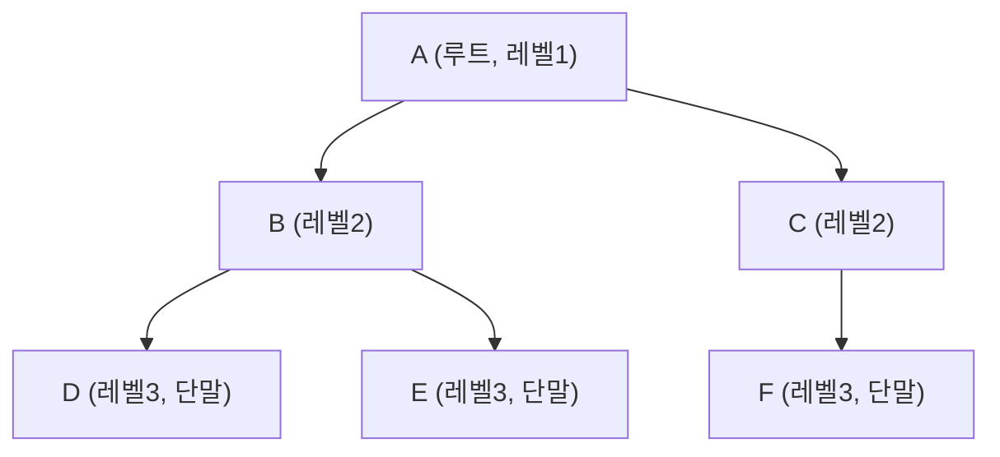

- 예시
	- `B, C` : `A`의 자식. `B, C`끼리는 서로 형제이기도 하다.
	- `B, D, E` 자체는 하나의 서브트리.

### 이해
- 루트로부터 임의의 한 노드까지 가는 경로는 항상 유일하다. 
	- = 사이클이 없다.
- "트리 안에 서브트리가 있고, 그 서브트리도 트리다"라는 재귀적 정의는 이후 순회 / 삽입 / 삭제를 재귀 함수로 짜는 이유가 된다.

## 이진 트리

### 이진 트리의 개념과 구조
- 각 노드가 자식을 최대 2개까지만 가질 수 있는 트리.
- 일반 트리와 다르게, `왼쪽 자식Left Child`과 `오른쪽 자식Right Child`을 구분해서 부른다. 
- 중요한 이유 : 자식 수가 최대 2개로 고정되어 있기 때문에, 배열(순차 자료 구조)로도 자연스럽게 표현할 수 있고, 이 구조를 기반으로 순회, 탐색, 정렬 알고리즘이 이어진다.

- 이해(루트 = 레벨 1)
	- 레벨 `i`에서 존재할 수 있는 최대 노드의 개수 :  $2^{i-1}$
	- 높이 `h`인 이진 트리가 가질 수 있는 최대 노드 수 : $2^h -1$ 
	- 노드가 `n`개일 때의 최소 높이 : $log_{2}(n+1)$
		- 이 하한값이 균형 트리(AVL)를 쓰는 것에 대한 근거가 된다.

### 이진 트리의 추상 자료형
```cs
public interface IBibaryTree<T>
{
	Bool IsEmpty { get; }
	
	T GetLeft(T node);
	T GetRight(T node);
	
	void InsertLeft(T parent, T node); 
	void InsertRight(T parent, T node);
	
	void Preorder(); // 전위 순회
	void Inorder(); // 중위 순회
	void Postorder(); // 후위 순회
}
```
### 이진 트리의 종류
- **포화 이진 트리(Full Binary Tree)** : 모든 레벨이 노드로 완전히 채워진 트리. 높이가 `h`면 노드 수는 $2^h - 1$개
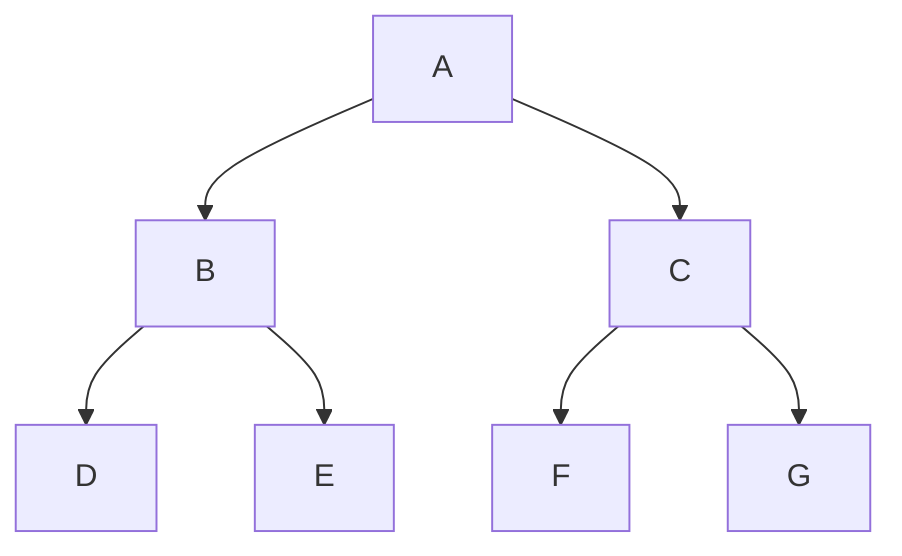

- **완전 이진 트리(Complete Binary Tree)** : 마지막 레벨을 제외한 모든 레벨이 채워져 있고, 마지막 레벨은 왼쪽부터 순서대로 채워진 트리. 
	- 배열의 인덱스만으로 부모 / 자식 관계를 계산할 수 있다.

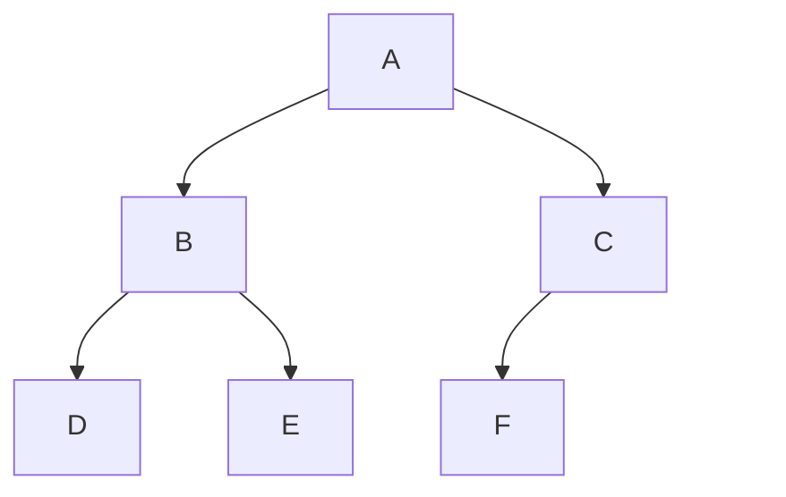
> G자리가 비어있다는 것이 포화 이진 트리와의 차이점인데, 마지막의 빈 자리가 "오른쪽 자식"이여야 완전 이진 트리 조건을 충족한다.

- **편향 이진 트리(Skewd Binary Tree)** : 노드들이 한쪽 방향으로만 계속 자식을 갖는 트리. 
	- 연결 리스트와 다를 게 없는 형태로, 이진 탐색 트리에서 다루는 최악의 성능이 이 모양에서 나온다.

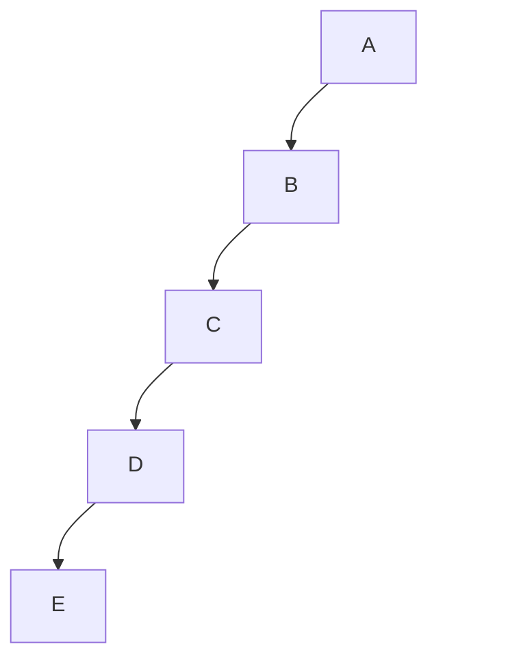

## 이진 트리의 구현
### 순차 자료구조를 이용한 이진 트리의 구현
- 완전 이진 트리의 성질인 "레벨 순서대로 빈틈없이 채워짐"을 이용해서, 노드를 배열 인덱스로 표현한다. 인덱스를 1부터 시작한다고 할 때, 부모 / 자식 관계가 다음처럼 나온다.


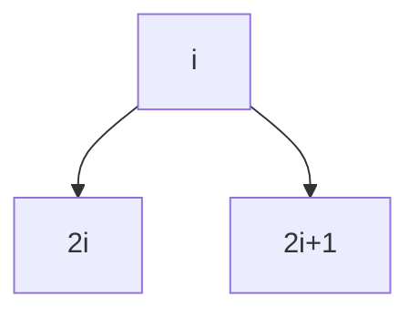
1. 인덱스 `i`인 노드의 왼쪽 자식은 인덱스 `2i`
2. 인덱스 `i`인 노드의 오른쪽 자식은 인덱스 `2i + 1`
3. 인덱스 `i`인 노드의 부모는 인덱스 `i / 2`(정수 나눗셈)
4. 삽입은 완전 이진 트리 조건을 유지해야 함 - 항상 배열의 다음 빈 자리(마지막 자리 다음)에 넣는다.

```cs
public class ArrayBinaryTree<T>
{
	private T[] nodes;
	private int count;
	
	public ArrayBinaryTree(int capaicty = 16)
	{
		nodes = new T[capacity + 1]; // 인덱스 0을 사용하지 않고 1부터 씀
		count = 0;
	}
	
	public bool IsEmpty => count == 0;
	
	// 완전 이진 트리 조건을 유지하기 위해 항상 마지막 빈 자리에 삽입
	public void Insert(T data)
	{
		// 2배씩 늘리는 그 리사이즈 로직.
		if (count + 1 => nodes.Length)
			Array.Resize(ref nodes, nodes.Length + 1);
		
		nodes[++count] = data; 
	}
	
	// <= 는 그냥 비교 연산자 
	public T GetLeft(int index) => 2 * index <= count ? nodes[2 * index] : default;
	public T GetRight(int index) => 2 * index + 1 <= count ? nodes[2 * index] : default;
	public T GetParent(int index) => index > 1 ? nodes[index / 2] : default; 
}
```
- **인덱스를 1부터 시작**하는 이유 : 0부터 시작하면 왼쪽 / 오른쪽 자식 공식이 `2i + 1, 2i + 2`로 지저분해진다.
- `GetLeft/GetRight`가 범위를 벗어나면 `default`를 반환한다. 참조 타입이라면 `null`이지만 값 타입이라면 `0` 등의 기본값이 나오는데, "자식이 없다"와 "기본값이다"를 구분하는 상황이라면 이 방식으로는 부족해서 별도의 처리가 필요함.
- `IBinaryTree<T>` 인터페이스는 `T : node`인 것처럼 구현했지만, 여기선 인덱스 = 노드의 역할을 하므로 다소 단순화해서 구현된 형태.

### 연결 자료구조를 이용한 이진 트리의 구현
- 각 노드가 왼쪽 / 오른쪽 자식에 대한 참조를 직접 들고 있는 방식.

1. 노드를 새로 만들 때 왼쪽/오른쪽 자식을 일단 `null`로 비워둔다.
2. 특정 부모 노드의 왼쪽/오른쪽 자식으로 새 노드를 연결한다.
3. 이미 그 자리에 자식이 있으면 덮어쓰지 않고 예외를 던진다.

```cs
// 개별 노드 정의
public class Node<T>
{
	public T Data { get; set; }
	public Node<T> Left { get; set; }
	public Node<T> Right { get; set; }
	
	public Node(T data)
	{
		Data = data;
	}
}

// 연결 이진 트리
public class LinkedBinaryTree<T> : IBinaryTree<Node<T>>
{
	public Node<T> Root { get; private set; }
	
	public LinkedBinaryTree(Node<T> root = null)
	{
		Root = root;
	}
	
	public bool IsEmpty => Root == null;
	
	public Node<T> GetLeft(Node<T> node) => node?.Left;
	public Node<T> GetRight(Node<T> node) => node?.Right;
	
	public void InsertLeft(Node<T> parent, Node<T> node)
	{
		if (parent.Left != null)
			throw new InvalidOperationException("이미 왼쪽 자식이 있음");
		parent.Left = node;
	}
	
	public void InsertRight(Node<T> parent, Node<T> node)
	{
		if (parent.Right != null)
			throw new InvalidOperationException("이미 오른쪽 자식이 있음");
		parent.Right = node;
	}
	
	// 순회는 아래에서 따로 구현
}
```
- `IBinaryTree<T>`에 `Node<T>`를 그대로 넣어서 인터페이스를 정확히 구현함. 노드 자체가 데이터이면서 자식에 대한 참조를 함께 들고 있는 연결 구조로, 인터페이스와 자연스럽게 맞아떨어진다.
- `GetLeft`에서 `node?.Left`처럼 `null` 조건 연산자 `?.`를 쓴 이유는 순회 도중 존재하지 않는 자식을 조회할 때 오류 `NullReferenceException` 대신 `null`을 돌려받기 때문이다. 

### 이해
- 두 방식의 트레이드오프
	- **순차(배열) 구조**는 완전 이진 트리가 아니면 빈 칸이 생겨 메모리가 낭비됨.
	- **연결 구조**는 낭비는 없으나 자식을 가리키는 참조를 노드마다 추가로 들고 있어야 함. 

## 이진 트리의 순회

### 개념
- `순회Traversal` : 트리의 모든 노드를 빠짐없이 1번씩 방문하는 것.
- 이진 트리는 항상 "현재 노드 방문 + 왼쪽 서브트리 순회 + 오른쪽 서브트리 순회"라는 세 가지 일을 어떤 순서로 하느냐에 따라 순회 방식이 갈린다. 그래서 순회 자체가 자연스럽게 재귀적으로 정의된다.

- 예시 트리


### 전위 순회
- 순서 : 노드 방문 -> 왼쪽 서브트리 -> 오른쪽 서브트리
- 위 예시 트리에서는 `A -> B -> D -> E -> C -> F`
### 중위 순회
- 순서 : 왼쪽 서브트리 -> 노드 방문 -> 오른쪽 서브 트리
- 위 예시 트리 : `D -> B -> E -> A -> F -> C`
### 후위 순회
- 순서 : 왼쪽 서브트리 -> 오른쪽 서브트리 -> 노드 방문
- 위 예시 트리 : `D -> E -> B -> F -> C -> A`
### 순회 구현
- 세 방식 모두 재귀 호출의 순서만 다르고, 구조는 동일하다.
### 프로그램
```cs
// 전위 순회
public void Preorder() => PreorderHelper(Root);

private void PreorderHelper(Node<T> node)
{
	if (node == null) return;
	
	Console.Write($"{Node.Data} "); // 기준 노드 출력
	PreorderHelper(node.Left); // 왼쪽 서브트리 순회
	PreorderHelper(node.Right); // 오른쪽 서브트리 순회
} 

// 중위 순회
public void Inorder() => InorderHelper(Root);

private void InorderHelper(Node<T> node)
{
	if (node == null) return;
	
	InorderHelper(node.Left); // 왼쪽 서브트리 순회
	Console.Write($"{Node.Data} "); // 기준 노드 출력
	InorderHelper(node.Right); // 오른쪽 서브트리 순회
} 


// 후위 순회
public void Postorder() => PostorderHelper(Root);

private void PostorderHelper(Node<T> node)
{
	if (node == null) return;

	PostorderHelper(node.Left); // 왼쪽 서브트리 순회
	PostorderHelper(node.Right); // 오른쪽 서브트리 순회
	Console.Write($"{Node.Data} "); // 기준 노드 출력
} 
```
- 코드로 뜯어보면 `Left -> Right` 순서는 동일하며, `Console.Write()` 문의 위치만 앞, 중간, 뒤로 달라지는 걸 볼 수 있음. 이 위치가 "언제 노드를 방문하는가"라는 의미.
- `Helper`를 따로 분리한 이유는 인터페이스에는 해당 메서드들이 노드 파라미터를 받지 않기 때문이다.
- `if (node == null) return;` 은 이 재귀의 기저 사례.

#### 수식 이진 트리 순회 프로그램
- 연산자를 내부 노드에, 피연산자를 리프 노드에 두면 수식 자체를 이진 트리로 표현할 수 있다.
- 예시 : `(A + B) * C`
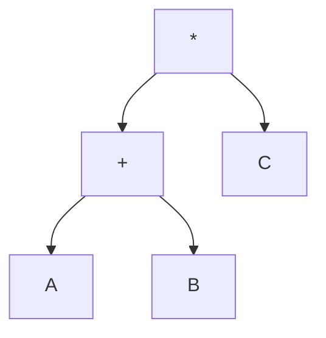
- 트리를 만드는 방법 
	- **가장 마지막에 계산되는 연산자가 트리의 루트**다. 좌우에는 실제 순서와 대응되는 각각의 피연산자가 온다.
	- `A + B`를 계산한 후, `C`를 곱하는 형태인데 `A + B`는 다시 `A(왼쪽)`, `+(루트)`, `B(오른쪽)`이라는 형태로 나눌 수 있음. 

- 전위 순회 : `* + A B C` - `전위 표기법 prefix`
- 중위 순회 : `A + B * C` - `중위 표기법 infix`, 원래 식과 유사
- 후위 순회 : `A B + C *` - `후위 표기법, postfix`

- 계산기와 컴파일러가 실제로 이 대응 관계를 이용한다.

- 계산 절차(후위 순회 기반)
	1. 왼쪽 서브트리를 먼저 계산해서 값 하나로 만든다.
	2. 오른쪽 서브트리를 계산해서 값 하나로 만든다.
	3. 현재 노드가 연산자라면 두 값에 그 연산을 적용한 결과를 반환하고, 피연산자면 그 값 자체를 반환한다. 

```cs
public class ExpressionTree
{
	public Node<string> Root { get; set; }
	
	public double Evaluate() => EvaluateHelper(Root);
	
	private double EvaluateHelper(Node<string> node)
	{
		if (node.Left == null && node.Right == null)
			return double.Parse(node.Data); // 리프 노드 = 피연산자, 값
		
		double left = EvaluateHelper(node.Left);
		double right = EvaluateHelper(node.Right);
		
		return node.Data switch 
		{
			"+" => left + right,
			"-" => left - right,
			"*" => left * right,
			"/" => left / right,
			_ => throw new InvalidOperationException($"알 수 없는 연산자: {node.Data}");
		} 
	}
}
```
- "왼쪽 -> 오른쪽 -> 현재 노드 처리"라는 순서 자체가 후위 순회를 그대로 따르는 것.
- 리프 판별을 자식의 유무로 하는 이유 - `node.Data`을 문자열 내용으로 구분하는 것보다 트리 구조로 구분하는 게 더 안전하다. (연산자 문자와 겹치는 피연산자가 들어올 걱정이 없기 때문.)
- `switch expression` 사용. [[Csharp - switch|switch]] 참고.

#### 이진 트리 순회의 응용 프로그램
- 폴더 / 파일 구조도 트리로 표현할 수 있다. 
- 전위 순회로 방문하며 깊이만큼 들여쓰면, 탐색기에서 보는 것과 비슷한 트리 형태로 출력할 수 있다. 

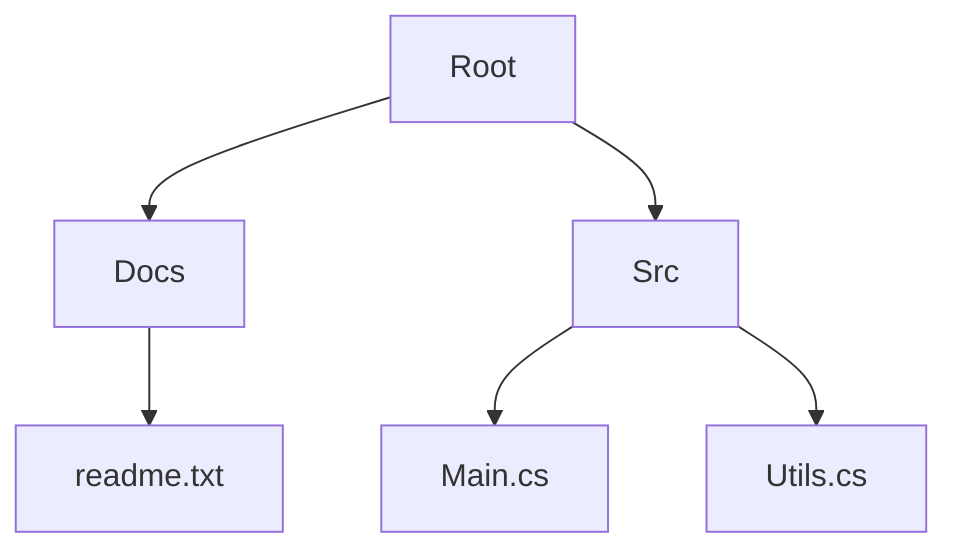

1. 현재 노드를 `depth`만큼 들여써서 출력한다.
2. 왼쪽 자식을 `depth + 1`로 재귀호출한다.
3. 오른쪽 자식을 `depth + 1`로 재귀호출한다.

```cs
public class FileSystemTree
{
	public Node<String> Root { get; set; }
	
	public void PrintStructure() => PrintHelper(Root, 0);
	
	private void PrintHelper(Node<string> node, int depth)
	{
		if (node == null) return;
		
		Console.WriteLine(new string(' ', depth * 2) + node.Data);
		PrintHelper(node.Left, depth + 1);
		PrintHelper(node.right, depth + 1);
	}
}
```
- 실제 파일 시스템은 폴더 1개에 **자식이 여러 개**인 일반 트리에 가깝지만, 왼쪽 자식 = 1번째 하위 항목, 오른쪽 자식 = 바로 다음 형제로 매핑하면 이진 트리 하나로 표현할 수도 있다.
- `depth`를 재귀 호출마다 넘기는 이유 - 들여쓰기 계산 때문. 트리 구조를 따라가는 로직과 출력 형식(들여쓰기) 로직이 한꺼번에 처리됨.
- `new string(' ', n)`은 공백 문자를 n번 반복한 문자열을 만드는 C# 관용구이다.

### 스레드 이진 트리Threaded Binary Tree
- 문제의식 : 일반 연결 이진 트리는 리프 노드에 가까울수록 `Left` / `Right`가 `null`인 경우가 많음. 정확히는, 노드가 `n`개면 `null` 링크가 `n+1`개 존재한다.
- 스레드 이진 트리는 **버려지는 `null` 자리를 순회 순서상 다음 / 이전 노드를 직접 가리키는 `스레드thread`로 활용하는 방식**이다.
- 원래 있던 자식 링크와 새로 채워넣은 스레드 링크를 구분하기 위해, 노드마다 "이 링크가 진짜 자식인지 스레드인지를 구별하는 플래그"가 추가로 필요하다.

- 장점 : 스레드를 따라가기만 하면 되므로, 재귀나 별도 스택 없이 반복문으로 순회를 수행할 수 있다.

#### 노드 정의
- `Node<T>`와 다른 점 : `IsLeftThread, IsRightThread`라는 플래그가 추가된다. 진짜 자식을 가리키는지, 스레드를 가리키는지를 구분한다.
```cs
public class ThreadedNode<T>
{
	public T Data { get; set; }
	public ThreadedNode<T> Left { get; set; }
	public ThreadedNode<T> Right { get; set; }
	public bool IsLeftThread { get; set; }
	public bool IsRightThread { get; set; }
	
	public ThreadedNode(T data)
	{
		Data = data;
		IsLeftThread = true;
		IsRightThread = true;
	}
}
```
> 새 노드를 만들 때는 아직 자식이 없기 때문에 두 플래그를 `true(스레드)`로 시작, 진짜 자식이 연결되는 시점에 `false`로 바꾸면 된다.

#### 삽입 및 중위 후속자 탐색 연산
- 가장 기본이 되는, 부모 노드가 원래 왼쪽 자식이 없던 자리에 새 노드를 끼워넣는 경우만 다룬다.

1. 새 노드의 `Left`는 부모가 원래 갖고 있던 스레드(부모의 중위 선행자)를 그대로 물려받는다.
2. 새 노드의 `Right`는 부모 자신을 가리키는 스레드로 설정한다. 
	- 새 노드 다음에 순회할 노드가 부모이기 때문.
3. 부모의 `Left`는 새 노드를 가리키도록 바꾸고, 진짜 자식이 생겼으므로 `IsLeftThread = false`로 바꾼다.

> **선행자, 후속자** 
> - 선행자(Predescessor) : 나 이전에 방문한 노드
> - 후속자(Successor) : 나 이후에 방문한 노드

- 후속자 탐색(=다음 노드를 찾는 절차)
1. 현재 노드의 `Right`가 스레드면, 그 스레드가 가리키는 노드가 다음 노드.
2. `Right`가 진짜 자식이면 그 오른쪽 서브트리에서 갖아 왼쪽의 노드를 찾아 내려간다.

```cs
public class ThreadedBinaryTree<T>
{
	public ThreadedNode<T> Root { get; private set; }
	
	public ThreadedBinaryTree(ThreadedNode<T> root = null)
	{
		Root = root;
	}
	
	// 삽입 : parent에서 왼쪽 자식이 없던 자리에 node를 끼워넣으며 스레드를 연결
	public void InsertLeft(ThreadedNode<T> parent, ThreadedNode<T> node)
	{
		// 1. 왼쪽 노드는 부모의 중위 선행자(=부모 바로 앞 방문 노드)를 물려받는다.
		node.Left = parent.Left;
		node.IsLeftThread = parent.IsLeftThread;
		
		// 2. 오른쪽 노드는 부모 자신을 가리키는 스레드로 설정한다.
		node.Right = parent;
		node.IsRightThread = true;
		
		// 3. 부모의 Left는 새 노드를 가리키도록 바꾼다.
		parent.Left = node;
		parent.IsLeftThread = false;
	}
	
	// 중위 순회, 가장 왼쪽 노드부터 시작하는 탐색
	private ThreadedNode<T> FindLeftmost(ThreadedNode<T> node)
	{
		if (node == null) return null;
		
		while (!node.IsLeftThread && node.Left != null)
			node = node.Left;
			
		return node;
	}
	
	// 재귀와 스택 없이 다음 노드를 바로 찾는다.
	private ThreadedNode<T> GetInorderSucessor(ThreadedNode<T> node)
	{
		if (node.IsRightThread)
			return node.Right;
		
		return FindLeftmost(node.Right);
	}
	
	public void InorderTraversal()
	{
		var current = FindLeftmost(Root);
		
		while (current != null)
		{
			Console.Write($"{current.Data} ");
			current = GetInorderSuccessor(current);
		}
	}
}
```
- 중위 탐색 **`InorderTraversal()`에 재귀 호출과 스택이 전혀 없다**는 게 핵심이다. `while` 반복문 하나만으로 순회가 끝난다. 이게 스레드 이진 트리의 장점으로, $O(h)$($h$ = 트리 높이)의 공간 복잡도를 $O(1)$로 줄일 수 있다.
- `FindLeftmost`가 두 조건을 체크하는 이유
	- `IsLeftThread`만 믿어도 되나, `Left = null`인 최초 상태까지 방어적으로 처리할 수 있다.
- `InsertLeft`는 단순화된 버전으로, 이미 왼쪽 서브트리가 있는 자리에 끼워넣는 경우까지 일반화하려면 로직이 더 복잡하다. 가장 기본적인 경우만 체크하고 넘김.

## 이진 탐색 트리

### 개념
- `왼쪽 서브트리의 모든 노드 값 < 루트 값 < 오른쪽 서브트리의 모든 노드 값`이라는 규칙이 모든 서브트리에 재귀적으로 적용됨.
- 필요한 이유
	- **정렬된 배열**의 경우 탐색은 빠르나 삽입/삭제가 느리다.
		- 탐색 : 이진 탐색의 경우 $O(log n)$ 
		- 삽입, 삭제 : $O(n)$ - 배열을 밀거나 당겨야 하므로
	- **연결 리스트**는 삽입/삭제는 빠르나 탐색이 느리다.
		- 탐색 : $O(n)$ 
		- 삽입 / 삭제 : $O(1)$
	- **이진 탐색 트리**는 이 둘을 절충해서 **탐색, 삽입, 삭제 모두 $O(h)$로 처리하는 게 목표**다.

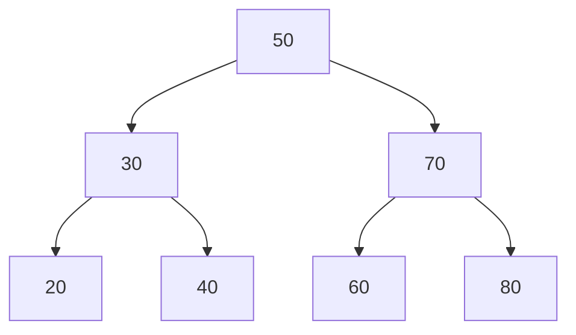

- 이해
	- **$O(h)$는 트리가 균형잡혀 있을 때의 이야기**이고, 삽입 순서에 따라 편향 트리가 되면 h가 n에 가까워져서 worst case에서 $O(n)$로 연결 리스트와 똑같게 된다. 이를 해결하기 위한 게 아래 로직들.
### 탐색 연산
1. 루트에서 시작한다.
2. 찾는 값이 현재 노드보다 작으면 왼쪽 자식, 크면 오른쪽 자식으로 이동한다.
3. 값이 같으면 찾은 것이며, 자식이 없는 자리`null`까지 내려가면 트리에 없는 값이다.

```cs
public class BinarySearchTree<T> where T : IComparable<T>
{
	public Node<T> Root { get; private set; }
	
	public bool IsEmpty => Root == null;
	
	public Node<T> Search(T data) => SearchHelper(Root, data);
	
	private Node<T> SearchHelper(Node<T> node, T data)
	{
		if (node == null) return null;
		
		int compare = data.CompareTo(node.Data);
		
		if (compare == 0) return node;
		return compare < 0 ? SearchHelper(node.Left, data) : SearchHelper(node.Right, data);
	}
}
```
- **`where T : IComparable<T>`가 필요한 이유**
	- 이진 탐색 트리는 값의 대소 비교가 핵심인데, 아무 타입의 `T`가 들어오면 비교 방법을 알 수 없음.
	- `int, string` 등의 `IComparable`을 구현한 타입이거나, 사용자 정의 타입이라면 직접 구현해서 넘겨야 함.
- **`data.CompareTo(node.Data)`**
	- `data`가 더 작으면 음수, 같으면 0, 크면 양수를 반환한다.
	- `EqaulityComparere<T>.Default.Equals`가 아니라 이걸 쓰는데, 같은지 여부를 넘어, 대소 관계까지 필요하기 때문이다.

### 삽입 연산
1. 탐색과 똑같은 방식으로 값을 비교하며 내려간다.
2. 자식이 없는 자리에 도달하면, 그 자리가 삽입 위치로 새 노드를 만들어 연결한다.
3. 이미 같은 값이 있으면 삽입하지 않는다. (중복 값을 허용하지 않음)

```cs
public void Insert(T data)
{
	Root = InsertHelper(Root, data);
}

private Node<T> InsertHelper(Node<T> node, T data)
{
	// 
	if (node == null) return new Node<T>(data);
	
	int compare = data.CompareTo(node.Data);
	
	if (compare < 0)
		node.Left = InsertHelper(node.Left, data);
	else if (compare > 0)
		node.Right = InsertHeper(node.Right, data);
	
	// compare == 0이라면 아무것도 하지 않음 - 이미 있는 값이므로
	
	return node;
}
```
- 핵심 : `InsertHelper`가 서브 트리의 새 루트를 반환하고, 그 반환값을 부모에서 `node.Left = ...` / `node.Right = ...`으로 다시 이어붙이는 구조. 
- 1개의 재귀호출이 링크를 새로 갱신하면서 올라오는 구조이므로, 삽입 위치를 찾아 내려간 뒤 별도로 부모를 기억했다가 연결하는 코드가 필요하지 않다.
- 이 `반환 후 재할당` 패턴은 삭제 연산에서도 동일하게 쓰인다. 
### 삭제 연산

#### 차수 = 0인 단말 노드에서의 삭제 연산
- 자식이 없는 노드니까 그 자리만 `null`로 만들면 끝. 부모의 링크만 끊어주면 된다.
#### 차수 = 1인 노드의 삭제 연산
- 자식을 삭제할 노드가 있던 자리로 끌어올린다. 
#### 차수 = 2인 노드의 삭제 연산
- 자식이 둘일 경우, 삭제된 노드의 자리를 채울 로직이 필요하다.
1. 오른쪽 서브트리에서 가장 작은 값(=중위 후속자)을 찾는다. 
	- 왼쪽 서브트리의 중위 선행자를 써도 대칭적으로 동일하게 동작하나, 관례상 중위 후속자를 더 많이 사용한다. 
2. 삭제할 노드의 값을 후속자의 값으로 바꾼다.
3. 원래 있던 후속자 노드를 오른쪽 서브트리에서 삭제한다. 
	- 후속자는 정의 상 "가장 작은 값"이라서 왼쪽 자식이 없기 때문에 이 삭제는 항상 차수 0이나 1 케이스로 귀결된다.

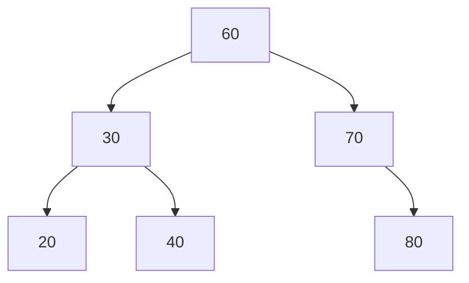
- 루트 노드인 `50`을 삭제한다면, 오른쪽 서브트리의 최솟값 `60`이 루트 자리로 올라오고 `70`의 왼쪽 자리가 비게 되는 형태.

```cs
public void Delete(T data)
{
	Root = DeleteHelper(Root, data);
}

private Node<T> DeleteHelper(Node<T> node, T data)
{
	if (node == null) return null;
	
	int compare = data.CompareTo(node.Data);
	
	if (compare < 0 )
	{
		node.Left = DeleteHelper(node.Left, data);
	}
	else if (compare > 0)
	{
		node.Right = DeleteHelper(node.Right, data);
	}
	else 
	{
		// 차수 0 
		if (node.Left == null && node.Right == null) 
			return null;
	
		// 차수 1
		if (node.Left == null) return node.Right;
		if (node.right == null) return node.Left; 
		
		// 차수 2 : 오른쪽 서브트리의 최솟값으로 값을 대체하고 후속자를 삭제
		Node<T> successor = FindMin(node.Right);
		node.Data = successor.Data; // 여기서는 값을 바꿔치기만 함
		node.Right = DeleteHelper(node.Right, successor.Data); // 노드 제거는 재귀 호출로 처리
	}
	
	return node;
}

private Node<T> FindMin(Node<T> node)
{
	while (node.Left != null)
		node = node.Left;
		
	return node;
}
```
- `else` 문의 차수 0 케이스의 경우, 차수 1의 `if (node.Left == null) return node.Right(=null)`로 한꺼번에 처리가 가능하다. 여기선 명료함을 위해 남겨둠.

### 이진 탐색 트리의 구현
- [[자료구조 - 이진 탐색 트리(Csharp)]]로 따로 빼둠. 위의 내용들을 이어붙였다.

>[!note]
>- 이진 탐색 트리에서 정렬된 데이터를 얻는 게 목적이라면, 기준이 되는 순회 방식은 **중위 순회**이다.
>	- `왼쪽 자식 < 부모 < 오른쪽 자식`이라는 크기 규칙을 가진 이진 탐색 트리에서, 중위 순회는 `왼쪽 -> 부모 -> 오른쪽 순서`로 방문하기 때문이다.
## 균형 이진 탐색 트리

### 개념
- 이진 탐색 트리는 삽입 순서에 따라 편향 트리가 될 수 있다. 이 경우 탐색, 삽입, 삭제가 전부 $O(n)$까지 나빠진다. 
- **균형 이진 탐색 트리는 삽입, 삭제가 일어날 때마다 트리 모양을 스스로 교정해 항상 높이가 $O(log \,n)$ 수준으로 유지되도록 보장**하는 트리이다. 
	- 균형을 유지한다 = 구체적으로 각 노드가 왼쪽 / 오른쪽 서브트리의 높이 차이를 일정 범위 이내로 제한한다는 의미.

### AVL 트리의 개념과 유형
- `균형 인수Balanced Factor, BF`
	- **`BF(node) = leftHeight - rightHeight`**

- AVL 트리 조건 : 모든 노드의 BF가 -1, 0, 1 중 하나여야 한다. 
	- 삽입 / 삭제 후 이 범위를 벗어나는 노드가 생기면 불균형 상태.

- 불균형 발생 패턴 - 어느 방향으로 두 번 치우쳐서 생겼는가에 따라 4가지로 나뉜다.
	- LL : 왼쪽 자식의 왼쪽 서브트리에 삽입되어 발생한 불균형
	- RR : 오른쪽 자식의 오른쪽 서브트리에 삽입되어 발생한 불균형
	- LR : 왼쪽 자식의 오른쪽 서브트리에 삽입되어 발생한 불균형
	- RL : 오른쪽 자식의 왼쪽 서브트리에 삽입되어 발생한 불균형

- LL/RR은 한 쪽으로 치우친 형태라 회전 한 번으로 교정, LR/RL은 지그재그라 2번 해야 한다.
- 회전 자체는 링크 몇 개만 바꿔끼우는 작업이라 $O(1)$이며, 삽입 경로를 따라 올라오면 각 노드의 BF를 갱신하는데 $O(h)$가 걸린다. 그래서 삽입 전체는 $O(log\,n)$을 유지한다. 
### AVL 트리의 회전 연산

>[!note]
>"어느 쪽으로 회전한다"의 정확한 정의. 차 핸들을 돌린다고 생각해보자.
>- 왼쪽으로 회전 : 오른쪽 자식 노드를 위로 올리고, 부모 노드를 왼쪽 아래로 내린다.
>- 오른쪽으로 회전 : 왼쪽 자식 노드를 위로 올리고, 부모 노드를 오른쪽 아래로 내린다.


#### LL 회전 연산
- 오른쪽으로 한 번 회전해서 교정한다.

- 불균형 상태
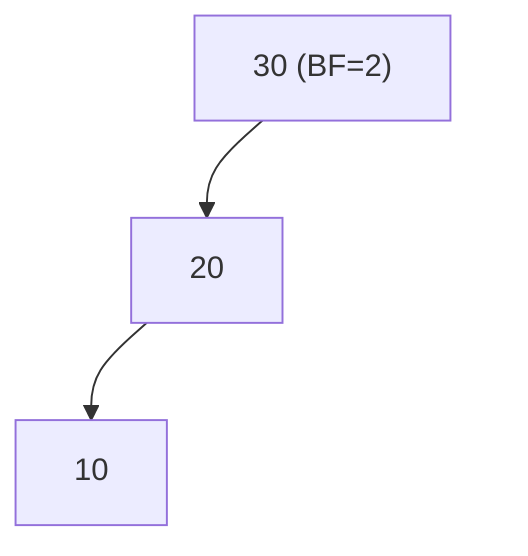

- 오른쪽 회전 후
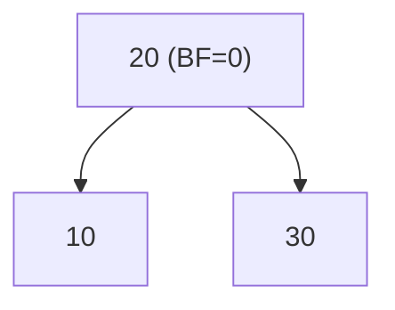

#### RR 회전 연산
- 왼쪽으로 한 번 회전해서 교정한다.

- 불균형 상태
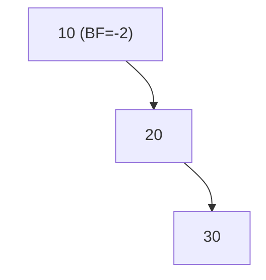

- 왼쪽 회전 후


#### LR 회전 연산
- 왼쪽 자식을 기준으로 왼쪽 회전을 한 후, 전체를 기준으로 오른쪽 회전을 한다.

- 불균형 상태
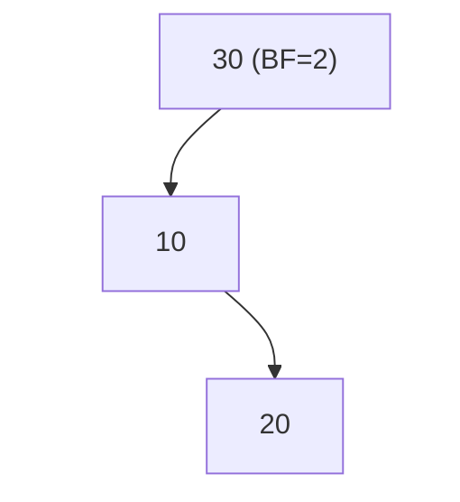

- 1단계 — `10`을 기준으로 왼쪽 회전 (LL 모양으로 바뀜):


- 2단계 — `30`을 기준으로 오른쪽 회전:


#### RL 회전 연산
- LR의 대칭. 오른쪽 자식을 기준으로 오른쪽 회전한 후, 전체를 왼쪽 회전한다.

- 불균형 상태
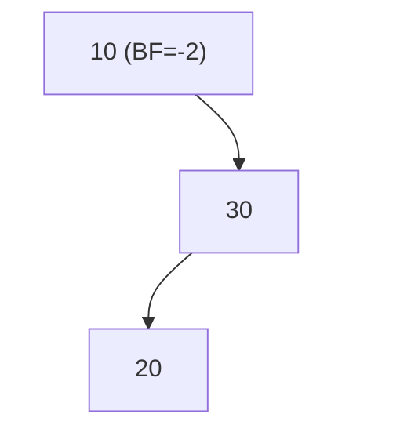


- 1단계 — `30`을 기준으로 오른쪽 회전 (RR 모양으로 바뀜)


- 2단계 — `10`을 기준으로 왼쪽 회전


#### AVL 트리 회전 연산 예
빈 트리에 `30, 20, 10` 순서대로 삽입하는 경우를 생각해보자.

1. `30` 삽입 : 트리에 빈 노드 하나 뿐이므로 `BF = 0`
2. `20` 삽입 : `30`의 왼쪽 자식, `30`의 BF = 1
3. `10` 삽입 : 
	1. `20`의 왼쪽 자식으로 들어가고, `30`의 BF = 2가 된다. 
	2. `10 < 20`이므로 `LL` 패턴
	3. `30`을 기준으로 오른쪽 회전 - 위 `LL` 연산의 회전 후 트리와 동일한 모양이 된다.

### AVL 트리의 구현
1. 높이를 노드에 직접 저장한 뒤, 삽입 후 루트까지 올라오며 높이를 갱신한다.
2. 이후 균형 인수를 계산한다.
3. 필요 시 회전한다.

- 노드 
```cs
public class AvlNode<T>
{
	public T Data { get; set; }
	public AvlNode<T> Left { get; set; }
	public AvlNode<T> Right { get; set; }
	public int Height { get; set; }
	
	public AvlNode(T data)
	{
		Data = data;
		Height = 1; // 리프로 삽입되는 시점, 높이 1로 설정.
	}
}
```


- 트리
```cs
public class AvlTree<T> where T : IComparable<T>
{
	public AvlNode<T> Root { get; private set; }
	public bool IsEmpty => Root == null;
	
	private int GetHeight(AvlNode<T> node) ==> node?.GetHeight ?? 0;
	
	// BF값 - 재귀식으로 처리
	private int GetBalanceFactor(AvlNode<T> node) => GetHeight(node.Left) - GetHeight(node.Right);
	
	// 노드의 Height값을 업데이트. 
	private void UpdateHeight(AvlNode<T> node) => node.Height = 1 + Math.Max(GetHeight(node.Left), GetHeight(node.Right));
	
	private AvlNode<T> RotateRight(AvlNode<T> node)
	{
		var newRoot = node.Left; 
		node.Left = newRoot.Right;  
		newRoot.Right = node; 
		
		UpdateHeight(node);
		UpdateHeight(newRoot);
		
		return newRoot;
	}
	
	private AvlNode<T> RotateLeft(AvlNode<T> node)
	{
		var newRoot = node.Right;
		node.Right = newRoot.Left;
		newRoot.Left = node;
		
		UpdateHeight(node);
		UpdateHeight(newRoot);
		
		return newRoot; 
	}
	
	public void Insert(T data)
	{
		Root = InsertHelper(Root, data);
	}
	
	private AvlNode<T> InsertHelper(AvlNode<T> node, T data)
	{
		if (node == null) return new AvlNode<T>(data);
		
		int compare = data.CompareTo(node.Data);
		
		if (compare < 0) 
			node.Left = InsertHelper(node.Left, data);
		else if (compare > 0)
			node.Right = InsertHelper(node.Right, data);
		else
			return node; // 중복 값은 삽입하지 않음
		
		UpdateHeight(node);
		
		int balance = GetBalanceFactor(node);
		
		if (balance > 1 && data.CompareTo(node.Left.Data < 0) // LL
			return RotateRight(node);
		
		if (balance < -1 && data.CompareTo(node.Right.Data) > 0) // RR
			return RotateLeft(node); 
			
		if (balance > 1 && data.CompareTo(node.Left.Data) > 0) // LR
		{
			node.Left = RotateLeft(node.Left);
			return RotateRight(node);
		}
		
		if (balance < -1 && data.CompareTo(node.Right.Data) < 0) 
		{
			node.Right = RotateRight(node.Right);
			return RotateRight;
		}
		
		return node;
	}
}
```

- 회전 그림 참고(`RotateRight` 기준)
![[Pasted image 20260818160944.jpg]]

-  **`우회전`이라는 말의 의미는 `왼쪽 자식`을 위로 올리고, `부모`를 오른쪽 아래로 내리는 것**이다. 

- 불균형이 발생한 기준 노드 `A`가 기준
```cs
var newRoot = node.Left; // 1.
node.Left = newRoot.Right;  // 2. 새 루트의 기존 오른쪽 자식 위치를 새로 설정 
newRoot.Right = node;  // 3.
```
1. 새로운 루트 지정. 여기서는 `B`가 된다.
2. `B`가 위로 올라가면, **원래 B가 갖고 있던 오른쪽 자식의 위치**를 설정해야 한다.
	- 기존 구조에서 값의 크기는 C < B < A 임이 보장된 상태다. B의 오른쪽 자식을 D라고 한다면, `B < D < A`임이 확실하다.
	- 따라서 `B`가 루트인 상태이고, `A`는 `B`의 오른쪽 노드로 내려갈 예정이므로(우회전) `A`의 왼쪽 자식 위치에 기존 오른쪽 자식의 위치를 할당한다.
	- 그래서 이 작업은 회전 작업에 들어가는 부가적인 작업이라고 생각하면 됨.
3. 새로운 루트 `B`의 오른쪽 자식으로 기존의 부모였던 `A`를 설정한다.


## 히프의 개념과 연산 및 구현

### 히프의 개념

### 히프의 추상 자료형

### 히프의 삽입 연산

### 히프의 삭제 연산

### 히프의 구현

 