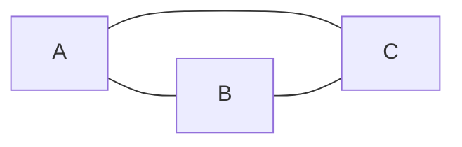
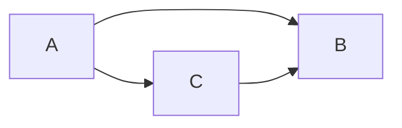
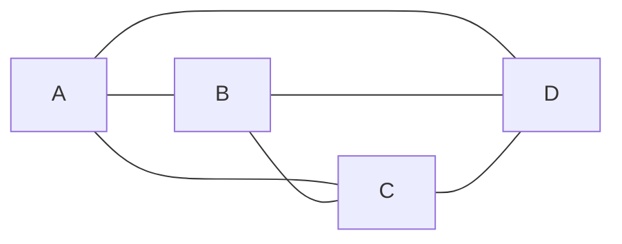
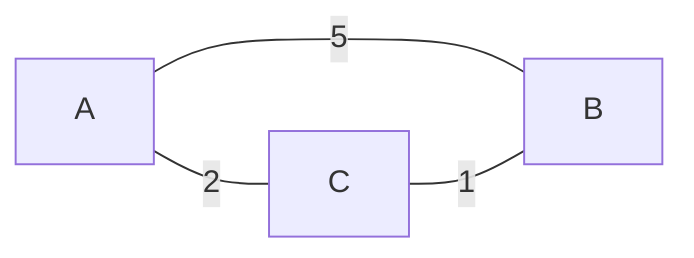
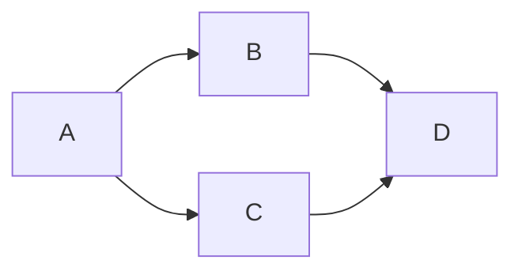
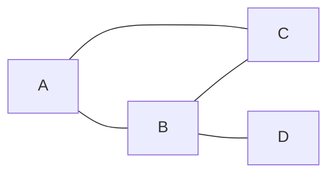
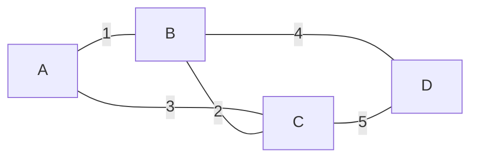
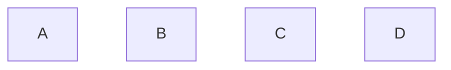
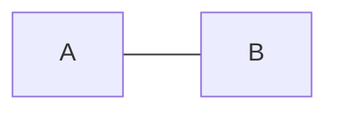
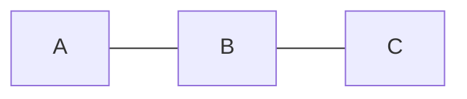

#자료구조

## 그래프의 구조

### 개념
- `정점Vertex`의 집합과 정점 쌍을 연결하는 `간선Edge`의 집합으로 구성
$$
G = (V, E)
$$
- 그래프는 정점 간의 임의의 관계(다대다, 사이클 포함)를 표현할 수 있음.
	- 트리도 그래프의 특수한 형태 - 사이클이 없는 연결 그래프

- 활용 예시
	- 지도(도시 간 도로)
	- 소셜 네트워크 - 친구 간 관계
	- 네트워크 토폴로지 등
### 종류

#### 무방향 그래프
- 간선에 방향이 없음. `(A, B) = (B, A)`
- 정점이 n개일 때 최대 간선 수 :  $\frac{n(n-1)}{2}$


#### 방향 그래프
- 간선에 방향이 있음 : `<A, B>`는 A에서 B로 가는 간선으로, `<B, A>`와 다르다.
- 정점이 `n`개 일 때 최대 간선 수 : $n(n-1)$


#### 완전 그래프
- 모든 정점 쌍 사이에 간선이 존재하는 그래프. 


#### 부분 그래프
- 원래의 그래프의 정점 집합과 간선 집합 중 일부로만 이루어진 그래프. (`V' ⊆ V`, `E' ⊆ E`)
- 원본 그래프에서 정점, 간선을 몇 개 뺀 그래프는 부분 그래프가 된다.

#### 가중 그래프
- 간선마다 가중치가 붙은 그래프.
- 최단 경로, 최소 비용 신장 트리 등 비용을 최소화하는 문제의 전제가 된다.



### 그래프 관련 용어
- **정점(Vertex)** : 그래프를 구성하는 각 노드
- **간선(Edge)** : 정점 사이를 잇는 선
- **인접(Adjacent)** : 간선으로 직접 연결된 두 정점의 관계
- **부속(Incident)** : 어떤 간선이 특정 정점에 연결되어 있는 관계(간선 기준으로 정점과의 관계를 가리키는 용어.)
- **차수(Degree)** : 한 정점에 연결된 간선의 수
	- 방향 그래프에서는 `진입 차수in-degree`와 `진출 차수out-degree`를 구분
- **경로(Path)** : 한 정점에서 다른 정점까지 간선을 따라가는 정점들의 나열
- **단순 경로(Simple Path)** : 경로 중 같은 정점을 2번 이상 지나지 않는 경로
- **사이클(Cycle)** : 시작 정점과 끝 정점이 같은 경로
- **연결 / 비연결 그래프** : 모든 정점 쌍 사이에 경로가 존재하면 연결 그래프, 아니라면 비연결 그래프.
- **연결 요소(Connected Component)** : 비연결 그래프에서 내부가 서로 연결된 부분 그래프 단위. 

### 그래프의 추상 자료형
```cs
public interface IGraph<T>
{
	bool IsEmpty { get; } // 정점이 하나도 없는지 확인
	int VertexCount { get; } // 정점 갯수
	
	void AddVertex(T data); // 정점 추가
	void AddEdge(int from, int to) // from -> to 간선 추가, 무방향일 경우 양방향 등록
	void RemoveVertex(int index); // 정점과 그에 연결된 간선을 모두 제거
	void RemoveEdge(int from, int to) // 간선 제거
	
	bool IsAdjacent(int fro, int to); // 두 정점의 인접한지 여부 확인
	List<int> GetAdjacentVertices(int index); // 특정 정점과 인접한 정점 목록
}
```

## 그래프의 구현

### 순차 자료구조를 이용한 그래프의 구현 - 인접 행렬

#### 개념
- 정점 N개를 `n*n` 2차원 배열로 표현 - `matrix[i][j]`는 정점 `i`에서 정점 `j`로 가는 간선의 유무, 혹은 가중치를 저장함.
- 무방향 그래프는 대칭 행렬이다. `matrix[i][j] == matrix[j][i]`

#### 이해
- 간선 유무만 필요하다면 값은 `0`과 `1`로 저장
- 가중 그래프일 경우 가중치 값을 저장한다. 단, "**값이 없음**"은 0이 아니라 `int.MaxValue` 같은 별도의 값으로 구분해야 한다.
	- 0을 가중치로 쓰는 그래프가 있을 수도 있기 때문임.
- 정점 수만큼 배열의 크기가 고정된다 - **정점을 추가/삭제할 때마다 행렬 전체를 다시 만들어야 한다.**


- 위 그래프의 인접 행렬 표현

|     | A   | B   | C   |
| --- | --- | --- | --- |
| A   | 0   | 1   | 1   |
| B   | 0   | 0   | 0   |
| C   | 0   | 1   | 0   |

#### 간선 추가 연산
1. 정점 `from`, `to`의 인덱스를 확인
2. `matrix[from][to]`에 값을 저장
3. 무방향 그래프라면 `matrix[to][from]`에도 같은 값을 저장한다.

#### 인접 정점 조회 연산
1. 정점 `index`에 해당하는 `row` 전체를 순회
2. 값이 0(또는 간선 없음 표시값)이 아닌 열의 인덱스를 결과 목록에 추가
3. 순회가 끝나면 결과 목록 반환. 
	- 정점 수가 n일 경우 이 조회 자체는 항상 $O(n)$

#### C# 구현
```cs
public class GraphByMatrix: IGraph<string>
{
	private const int NoEdge = 0;
	private string[] vertices;
	private int[,] matrix;
	private int count; // 인덱스 0 ~ count - 1까지는 모두 살아있는 정점이라고 가정
	
	public bool IsEmpty => count == 0;
	public int VertexCount => count;
	
	public GraphByMatrix(int capacity)
	{
		vertices = new string[capacity];
		matrix = new int[capacity, capacity];
		count = 0;
	}
	
	public void AddVertex(string data)
	{
		vertices[count] = data;
		count++;
	}
	
	public void AddEdge(int from, int to)
	{
		matrix[from, to] = 1;
		matrix[to, from] = 1; // 방향 그래프일 경우 제거
	}
	
	public void RemoveEdge(int from, int to)
	{
		matrix[from, to] = NoEdge;
		matrix[to, from] = NoEdge; 
	}
	
	public void RemoveVertex(int index)
	{
		// 정점이 제거되면 matrix 자체도 재배열되어야 한다. 그 로직은 생략
		for (int i = 0; i < count; i++)
		{
			matrix[index, i] = NoEdge;
			matrix[i, index] = NoEdge;
		}
	}
	
	public bool IsAdjacent(int from, int to)
	{
		retrun matrix[from, to] != NoEdge;
	}
	
	public List<int> GetAdjacentVertices(int index)
	{
		var result = new List<int>();
		for (int j = 0; j < count; j++)
		{
			if (matrix[index, j] != NoEdge)
				result.Add(j);
		}
		return result;
	}
}
```
- `int[,]` : 다차원 배열 - `int[][](Jagged Array)`와 다르게 2차원 행렬 하나로 메모리에 연속 배치됨.
- `NoEdge`를 따로 상수로 분리해서 "간선 없음"을 나타내는 값을 한 곳에서만 정의
- `RemoveVertex`의 경우 실제로는 정점 인덱스 재정렬까지 구현되어야 한다. 여기선 해당 행/열을 초기화하는 개념으로만 표시. 
	- 정점이 제거됐다 = 그래프의 `n x n`구조가 `(n-1) x (n-1)`이 됐다 -> 행렬 자체를 수정해야 함

### 연결 자료구조를 이용한 그래프의 구현 - 인접 리스트
#### 개념과 이해
- 정점마다 그 정점과 인접한 정점들의 리스트를 따로 유지한다. 
	- 배열 `adjList[i]`가 정점 `i`에서 나가는 간선들의 목적지 리스트.
- 인접 행렬이 정점 수 n에 비례해 $n^2$ 공간을 항상 쓰는 반면, 인접 리스트는 실제 존재하는 간선 수만큼만 공간을 쓴다.

- 인접 정점 조회가 인접 행렬에서는 항상 $O(n)$이지만, 인접 리스트에서는 그 정점에 실제로 연결된 간선 수만큼만 순회하면 된다. 
	- 희소 그래프(간선이 적은 그래프)일수록 인접 리스트가 유리.
- 두 정점이 인접한지에 대한 확인
	- 인접 행렬이 $O(1)$(배열 인덱스 접근)
	- 인접 리스트는 그 정점의 리스트를 끝까지 순회해야 하므로 $O(degree)$가 된다. 


- 인접 리스트 표현
	- A: [B, C]
	- B: []
	- C: [B]

#### 간선 추가 연산
1. 정점 `from`의 인접 리스트를 가져옴
2. 그 리스트에 정점 `to`를 추가
3. 무방향 그래프일 경우 `to`의 인접 리스트에도 `from`을 추가

#### 인접 정점 조회 연산
- 정점 `index`의 인접 리스트를 그대로 반환, 별도의 순회 / 필터링이 필요 없음.

#### C# 구현
```cs
public class GraphByList: IGraph<string>
{
	private string[] vertices;
	private List<int>[] adjList;
	private int count;
	
	public bool IsEmpty => count == 0;
	public int VertexCount => count;
	
	public GraphByList(int capacity)
	{
		vertices = new string[capacity];
		adjList = new List<int>[capacity];
		for (int i=0; i < capacity; i++)
			adjList[i] = new List<int>();
		count = 0;
	}
	
	public void AddVertex(string data)
	{
		vertices[count] = data;
		count++;
	}
	
	public void AddEdge(int from, int to)
	{
		adjList[from].Add(to);
		adjList[to].Add(from); // 방향 그래프라면 제거
	}
	
	public void RemoveEdge(int from, int to)
	{
		adjList[from].Remove(to);
		adjList[to].Remove(from);
	}
	
	public void RemoveVertex(int index)
	{
		// 다른 정점들의 리스트에서 index를 참조하는 항목도 함께 제거해야 함
		for (int i = 0; i < count; i++)
			adjList[i].Remove(index);
		adjList[index].Clear();
	}
	
	public bool IsAdjacent(int from, int to)
	{
		return adjList[from].Contains(to);
	}
	
	public List<int> GetAdjacentVertices(int index)
	{
		return adjList[index];
	}
}
```
- 배열 내에 각 정점별 `List<int>`을 담는 구조
	- 정점 갯수만큼 배열이 고정되고, 리스트는 각 정점의 간선 수만큼 가변
- `Remove(to)`는 내부적으로 리스트를 선형 탐색하므로 $O(degree)$
	- 인접 리스트가 조회는 빠르나 특정 간선 삭제는 리스트 크기에 따라 비용이 붙는다.
- `GetAdjacentVertices`는 내부 리스트의 참조를 그대로 반환한다. 
	- 실제로는 `new List<int>(adjList[index])` 등의 방어적 복사를 고려할 수 있으나, 여기선 개념만 보자.

## 그래프의 순회Traversal

### 개념과 종류
- 모든 정점을 빠짐없이 한 번씩만 방문하는 것.
- 트리 순회와 다르게 그래프는 사이클이 있을 수 있다. 그래서 "**방문 여부**"를 별도로 기록해야 한다.
- 크게 2가지 전략이 있음 : 깊이 우선 탐색, 너비 우선 탐색

- 이해
	- **다음에 방문할 정점을 어떤 자료구조에 담아 관리하는가**의 차이로 구현 방식이 갈린다. 
		 - DFS : 스택(or 재귀)
		 - BFS : 큐
	- 비연결 그래프일 경우 한 정점에서 시작된 순회만으로 전체 정점을 방문하지 못할 수도 있다. 이 경우, 방문되지 않은 정점을 새로운 시작점으로 순회를 다시 시작해야 한다.
### 깊이 우선 탐색(DFS, Depth First Search)
- 개념
	- 시작 정점에서 인접한 정점 하나를 골라 그 정점으로 이동하고, 그 정점에서 다시 인접한 정점으로 이동하는 식으로 가능한 계속 깊이 들어간다.
	- 더 이상 갈 곳이 없다(=인접 정점이 모두 방문 완료 상태)면, 바로 직전 정점으로 되돌아가(백트래킹) 아직 방문하지 않은 다른 인접 정점을 탐색한다.


- A에서 시작하면 방문 순서는 A -> B -> D -> C가 된다. B, C중 뭘 먼저 들어가는지의 차이.

#### 탐색 연산 - 재귀 방식
1. 시작 정점을 방문 처리하고 결과 목록에 추가
2. 시작 정점의 인접 정점들을 순서대로 확인
3. 아직 방문하지 않은 인접 정점이 있으면 그 정점을 새로운 시작 정점으로 삼아 1번부터 재귀 호출
4. 모든 인접 정점을 확인했다면 함수를 종료하고 호출한 곳으로 되돌아감

#### 탐색 연산 - 스택을 이용한 반복 방식
1. 시작 정점을 스택에 넣고 방문 처리
2. 스택이 비어있지 않은 동안 반복
	1. 스택의 `top` 정점을 확인
	2. 그 정점의 인접 정점 중, 아직 방문하지 않은 정점이 있다면 방문 처리하고 스택에 `push`
	3. 방문하지 않은 인접 정점이 없다면 `top`을 `pop`한다. 

#### C# 구현
```cs
public class DepthFirstSearch
{
	private IGraph<string> graph;
	private bool[] visited; // 방문 여부
	
	public DepthFirstSearch(IGraph<string> graph, int vertexCount)
	{
		this.graph = graph;
		visited = new bool[vertexCount];
	}
	
	// 재귀 방식
	public List<int> TraverseRecursive(int start)
	{
		var result = new List<int>();
		VisitRecursive(start, result);
		return result;
	}
	
	private void VisitRecursive(int vertex, List<int> start)
	{
		visited[vertex] = true;
		result.Add(vertex);
		
		foreach (var next in graph.GetAdjacentVertices(vertex))
		{
			if (!visited[next])
				VisitRecursive(next, result);
		}
	}
	
	// 스택을 이용한 반복 방식
	public List<int> TraverseIterative(int start)
	{
		var result = new List<int>();
		var stack = new Stack<int>();
		
		stack.Push(start);
		visited[start] = true;
		
		while (stack.Count > 0)
		{
			int current = stack.Peek();
			int? nextUnvisited = FindNextUnvisited(current);
			
			if (nextUnvisited.HasValue)
			{
				visited[nextUnvisited.Value] = true;
				result.Add(nextUnvisited.Value);
				stack.Push(nextUnivisited.Value);
			}
			else
			{
				stack.Pop();
			}
		}
		
		return result;
	}
	
	private int? FindNextUnvisited(int vertex)
	{
		foreach (var next in graph.GetAdjacentVertices(vertex))
		{
			if (!visited[next]) return next;
		}
		return null;
	}
}
```
- `visited` 배열은 순회 시작 전 한 번만 만들고 재사용한다. 매 탐색마다 새로 만들면 이전 순회 기록이 다음 순회에 영향을 주지 못하기 때문에, 매번 처음부터 다시 방문하게 된다. 
	- 비연결 그래프에서 의미가 있는 설정. 한번의 탐색으로 모든 걸 끝낼 수 없기 때문이다.
- 재귀 방식은 실제로는 함수 콜 스택이 `DFS`의 스택 역할을 한다. 반복 방식의 `Stack<int>`는 콜 스택을 명시적인 자료 구조로 직접 흉내낸 것.
- `nullable int`가 쓰인 이유 : "더 갈 곳이 없다"는 상태를 `-1` 등의 매직 넘버를 쓰는 대신 명확하게 표현하기 위함. 

### 너비 우선 탐색(BFS, Breadth First Search)
- 시작 정점에 가까운 정점부터 한 단계씩 넓게 퍼져나가면서 방문한다. 시작 정점의 모든 인접 정점들을 방문한 다음, 그 다음의 인접 정점들을 방문하는 식이다.
- 즉, 가까운 곳부터 층 단위로 넓혀가는 전략.


- BFS 방문 순서 : A -> B -> C -> D

- 이해
	- "먼저 발견한 정점을 먼저 방문한다"는 FIFO, 즉 **큐**와 일치하는 로직.
	- **방문한 순간(큐에 넣는 순간) `visited`에 표기**해야 한다. 
		- 큐에서 꺼낼 때 표기하면 같은 정점이 큐 안에 남아있는 동안 다른 경로에서 또 큐에 들어가서 중복 처리될 수 있다. 
		- (DFS의 구현도 방문한 순간 표기하고 있긴 함)

#### 탐색 연산
1. 시작 정점을 큐에 넣고, 방문 처리 후, 결과 목록에 추가
2. 큐가 비어있지 않은 동안 반복
	1. 큐에서 정점 하나를 꺼낸다.
	2. 꺼낸 정점의 인접 정점들을 순서대로 확인한다.
	3. 방문하지 않은 인접 정점이 있다면 방문 처리 후, 결과 목록에 추가하고, 큐에 넣는다. 
3. 큐가 빌 때까지 반복하면 시작 정점에서 도달 가능한 모든 정점을 층 단위로 방문 완료.

#### C# 구현
```cs
public class BreadthFirstSearch
{
	private IGraph<string> graph;
	private bool[] visited;
	
	public BreadthFirstSearch(IGraph<string> graph, int vertexCount)
	{
		this.graph = graph;
		visited = new bool[vertexCount];
	}
	
	public List<int> Traverse(int start)
	{
		var result = new List<int>();
		var queue = new Queue<int>();
		
		queue.Enqueue(start);
		visited[start] = true;
		
		while (queue.Count > 0)
		{
			int current = queue.Dequeue();
			result.Add(current);
			
			foreach (var next in grpah.GetAdjacentVertices(current))
			{
				if (!visited[next])
				{
					visited[next] = true; // 큐에 넣는 시점에 방문 처리
					queue.Enqueue(next); 
				}
			}
		}
		
		return result;
	}
}
```
- **방문한 시점에 `visited`에 표시하고, `Dequeue`한 시점에 `result`에 추가**한다. 
	- "방문 표시"와 "결과 기록"의 타이밍이 다른 이유는 위에서 다룬 중복 큐 삽입 문제 때문.
- DFS와 비교
	- 자료구조만 스택과 큐라는 차이가 있을 뿐, **발견 -> 방문 표시 -> 저장소에 담기 라는 골격은 동일**하다. 
	- 즉, **LIFO(DFS)냐 FIFO(BFS)냐의 차이만 있다**는 것. 


## 신장 트리와 최소 비용 신장 트리

### 신장 트리Spanning Tree

#### 개념과 이해
- 그래프의 모든 정점을 포함하면서, 간선은 트리가 되도록 딱 필요한 만큼만 골라낸 부분 그래프.
- **정점이 `n`개라면 신장 트리의 간선 수는 항상 `n - 1`개**다. 
	- 이보다 적으면 모든 정점이 연결되지 못한다.
	- 더 많다면 사이클이 생겨 트리가 아니게 된다. 

- **신장 트리를 만든다 = DFS나 BFS로 그래프를 순회하고, 순회 도중 새로 방문한 정점으로 이동할 때 사용한 간선만 남기는 것과 동일**하다. 이미 방문한 정점으로 되돌아가는(= 사이클을 만드는) 간선은 순회 과정에서 자연스럽게 무시되기 때문이다.
- 같은 그래프라도 어떤 정점에서 시작하는지, 어떤 탐색 로직을 쓰는지에 따라 다른 모양의 신장 트리가 나올 수 있다. 


- 여기서 A를 시작으로 DFS를 하면 방향에 따라 다르더라도 `A-B, B-C, A-C` 중 1개의 선이 없는 경로가 나타난다. 즉 간선 3개를 가진, 3개의 신장 트리를 가질 수 있는 형태.

#### C# 구현
```cs
public class SpanningTree
{
	private IGraph<string> graph;
	private bool[] visited;
	private List<(int from, int to)> treeEdges;
	
	public SpanningTree(IGraph<string> graph, int vertexCount)
	{
		this.graph = graph;
		visited = new bool[vertexCount];
		treeEdges = new List<(int, int)>();
	}
	
	public List<(int from, int to)> Build(int start)
	{
		visited[start] = true;
		VisitDfs(start);
		return treeEdges;
	}
	
	private void VisitDfs(int vertex)
	{
		foreach (var next in graph.GetAdjacentVertices(vertex))
		{
			if (!visited[next])
			{
				visited[next] = true;
				treeEdges.Add((vertex, next)); // dfs 과정에서 사용한 간선만 채택
				VisitDfs(next);
			}
		}
	}
}
```
- `(int from, int to)` 튜플로 간선을 표현한다. 간선 하나만을 위해 별도의 클래스를 구현하진 않음.
- 이미 방문한 정점으로 가는 노선은 `!visited[next]`에서 자연스럽게 걸러진다.

### 최소 비용 신장 트리(MST)

#### 개념과 이해
- 가중 그래프에서 만들 수 있는 여러 신장 트리 중, 간선 가중치의 합이 가장 작은 신장 트리.
- 신장 트리 자체는 `n-1`개의 간선만을 고르는 문제였다면, MST는 그 중 총 비용이 최소인 것까지 찾는 최적화 문제이다.

- MST를 구하는 2가지 알고리즘(크루스칼, 프림) 모두 **탐욕 알고리즘**으로, 현재 상태에서의 가장 저렴한 선택을 하고 이를 번복하지 않음을 의미한다.
- 크루스칼은 "간선 중심" : 전체 간선을 가중치 순으로 정렬한 뒤 하나씩 검토함
- 프림은 "정점 중심" : 트리를 점점 넓혀가며 경계에서 가장 저렴한 간선을 선택

#### 크루스칼 알고리즘

##### 개념과 이해
- 전체 간선을 **가중치가 큰 순서대로 정렬**한 뒤, 큰 것부터 하나씩 확인하며 "제거해도 그래프가 계속 연결 상태를 유지하는 간선"이면 제거하는 방식.
- 간선을 다 확인했을 때 남은 간선이 `n - 1`개라면 완성. 결과적으로 가중치가 큰 간선들을 최대한 쳐낸 형태가 된다.

- "이 간선을 제거해도 되는가?"의 기준
	- 제거한 뒤에도 두 정점이 다른 경로로 연결되어 있다면, 이 간선은 필수가 아니었다는 의미이므로 제거해도 무방함
	- 반대로 다른 경로가 없다면 유일한 경로이므로 제거하지 않음.
- 매 간선마다 "제거 후 연결 여부"를 확인해야 하므로, **간선 하나를 검토할 때마다 남은 그래프에 대한 DFS/BFS를 수행**한다. 
	- 삽입 방식의 Union - Find보다 매 단계의 비용이 더 크다.


- 가중치 순으로 내림차순하면 `(C-D, 5), (B-D, 4), (A-C, 3), (B-C, 2), (A-B, 1)`이 된다.
- `C-D` : 제거해도 C, D 간의 연결 상태 유지되므로 제거
- `B-D` : 제거하면 D로 가는 경로가 없으므로 남김
- `A-C` : 제거해도 C로 가는 경로 B-C가 있으므로 제거
	- 간선이 원래 5개였으므로, 2개를 제거한 이 시점에서 남은 간선은 3개로 `n-1`을 만족한다. 종료.

##### 구성 연산
1. 모든 간선을 가중치 내림차순으로 정렬
2. 정렬된 간선을 순서대로 확인하며 반복
	1. 간선을 그래프에서 **임시로** 제거
	2. 제거한 상태에서 두 정점의 연결 상태 확인(DFS/BFS로 경로 존재 여부 탐색)
	3. 연결된 상태면 제거 확정 후 다음 간선으로
	4. 연결이 끊어졌다면 취소하고 다음 간선으로
3. 남은 간선이 `n - 1`개가 되면 반복 종료

##### C# 구현
```cs
public class KruskalMstByRemoval
{
	public List<(int from, int to, int weight)> FindMst(
		List<(int from, int to, int weight)> edges, int vertexCount)
	{
		var remaining = edges.OrderByDescending(e => e.weight).ToList();
		
		for (int i = 0; i < remaining.Count; i++)
		{
			// 현재 간선
			var candidate = remaining[i];
			
			// 현재 간선을 제외한 나머지 간선들
			var withoutCandidate = new List<(int, int, int)>(remaining);
			withoutCandidate.RemoveAt(i);
			
			// 나머지 간선들을 BFS/DFS로 순회할 수 있는지 점검
			if (IsConnected(withoutCandidate, vertexCount))
			{
				remaining = withoutCandidate; // 제거해도 연결된 상태라면 제거 확정
				i--; // 리스트의 길이가 줄어들었으므로 다음에 방문할 인덱스는 값을 하나 줄임
			}
			
			// n - 1개의 간선이 남았다면 끝
			if (remaining.Count == vertex.Count - 1)
				break; 
		}
		
		return remaining;
	}
	
	// dfs로 간선들로 이루어진 그래프 전체를 탐색할 수 있는지 점검
	private bool IsConnected(List<(int from, int to, int weight)> edges, int vertexCount)
	{
		// 간선들로 인접 리스트 만들기
		var adjacency = new List<int>[vertexCount]; // 고정 크기의 배열을 만들듯이 이렇게 만들 수 있다.
		for (int i = 0; i < vertexCount; i++)
			adjacency = new List<int>[vertexCount];
		
		foreach (var edge in edges)
		{
			adjacency[edge.from].Add(edge.to);
			adjacency[edge.to].Add(edge.from);
		}
		
		var visited = new bool[vertexCount];
		var stack = new Stack<int>();
		stack.Push();
		visited[0] = true;
		int visitedCount = 1;
		
		while (stack.Count > 0)
		{
			int current = Stack.Pop();
			foreach (var next in adjacency[current])
			{
				if (!visited[next])
				{
					visited[next] = true;
					visitedCount++;
					stack.Push(next);
				}
			}
		}
		
		return visitedCount == vertexCount; // 모든 정점을 방문했다면 연결 상태
	}
}
```
- 간선 하나를 검토할 때마다 `IsConnected(그래프 전체 순회)`를 다시 호출한다. 그래서 비쌈.

#### 크루스칼 알고리즘 II
- 크루스칼 알고리즘이라고 하면 이 "삽입" 방식을 가리킨다. 

##### 개념과 이해
- 전체 간선을 가중치가 **작은** 순서대로 정렬한 뒤, 작은 것부터 하나씩 확인하면서 **사이클을 만들지 않는 간선만 삽입**하는 방식. 
- `n - 1`개의 간선이 들어가면 종료.

- "간선을 넣으면 사이클이 생기는가"를 매번 확인하기 위해 **`Union-Find(서로소 집합, Disjoint Set)` 자료구조를 사용**한다. 
	- 각 정점이 어느 그룹(집합)에 속하는지 관리하다가, 간선의 두 정점이 이미 같은 집합에 속해 있다면 그 간선은 사이클을 만드는 간선이므로 버린다.

##### 서로소 집합(Union - Find) 이해
- 정점 n개가 있을 때, 처음에는 자기 자신만 속한 집합으로 취급한다. 즉 집합 `n`개로 시작.
	- 집합 n개를 가진 배열 `parent`로 표현되며, **`parent[i]`는 정점 `i`가 속한 집합의 대표**를 가리킨다.
	- 초기 상태는 `parent[i] = i`, 자기 자신이 곧 집합의 루트가 됨.
- **Find(x)** : x가 속한 집합의 루트를 찾는 연산. 
	- `parent[x]`가 자기 자신이 아니라면, 부모를 따라 올라가 `parent[루트] == 루트`인 지점을 찾는다.
- **Union(a, b)** : a가 속한 집합과 b가 속한 집합을 하나로 합치는 연산. 
	- 실제로는 한쪽 집합의 루트가 다른 쪽 집합의 루트를 가리키게 만드는 것 뿐이다. 
	- `parent[Find(a)] = Find(b)`
- 간선 `(u, v)`를 검토할 때 `Find(u) == Find(v)`라면 `u, v`가 이미 같은 집합, 즉 어떤 경로로든 연결되어 있다는 의미다. 이 간선을 추가하면 사이클이 발생하므로 버린다. 다르다면 `Union`으로 합친다. 

```cs
// 경로 압축 없는 버전
private int Find(int vertex)
{
	if (parent[vertex] == vertex)
		return vertex;
	
	return Find(parent[vertex]); // 경로 압축 없이 단순히 부모의 루트를 찾아 반환
}

private void Union(int rootA, int rootB)
{
	parent[rootA] = rootB;
}
```
> 두 간선을 비교할 때, Union에 들어가는 두 인자는 루트 값임을 유념하자. 
> 즉 노드 A, B에 대해서 `Union(Find(A), Find(B))`처럼 쓰인다는 의미다. `Union(A, B)`가 아니라.
##### 경로 압축(Path Compression)
- **`Find`** 가 루트를 찾아 올라가는 길에 지나친 정점들을 다음번엔 한 번에 루트로 연결되도록 갱신하는 최적화.
	- 루트를 찾은 다음, 지나친 정점들의 `parent[i]`를 모두 루트로 업데이트한다.
	- **`parent[vertex]` 값의 업데이트 여부**가 경로 압축의 핵심이다.
- `D -> C -> B -> A(루트)` 순으로 부모를 타고 올라갔다고 치면, 경로 압축 후에는 `D, C, B`가 모두 `A`를 가리키므로 `Find(D)`가 1번의 접근으로 끝난다.
- 경로 압축이 없을 경우 한 줄로 길게 이어진 경우  `Find`가 $O(n)$까지 걸릴 수 있는데, 적용하면 $O(1)$에 가까워짐.

```cs
// 경로 압축 버전
private int Find(int vertex)
{
	if (parent[vertex] != vertex)
		parent[vertex] = Find(parent[vertex]); 
	return parent[vertex];
}
```


##### 서로소 집합 예제 - 경로 압축의 유무에 따른 차이까지 반영
- 위 그래프와 동일함


1. 4개의 정점은 모두 다른 집합에 속한다. 


```cs
// 각각 A, B, C, D라고 생각해주셈..
parent[0] = 0;
parent[1] = 1;
parent[2] = 2;
parent[3] = 3;
```

2. (A - B, 1) 검사
- 각각 Find(A) = A, Find(B) = B이므로 다른 집합이다. 
- Union으로 합친다.

```cs
// 기존 parent : {0, 1, 2, 3}

private void Union(int rootA, int rootB)
{
	parent[rootA] = rootB;
}

Union(Find(0), Find(1));

// 갱신된 parent : {1, 1, 2, 3}
```

2. (B - C, 2) 검사
- 1과 마찬가지로 처리됨.

```cs
// 기존 parent : {1, 1, 2, 3}

// Union(int rootA, int rootB)은 parent[rootA] = rootB;
Union(Find(1), Find(2)); // 이는 Union(1, 2)가 된다.

// 갱신된 parent : {1, 2, 2, 3}
```

3. (A - C, 3) 검사 
- A, C는 이미 같은 집합에 속해 있다. 
- 그래서 포함되지 않는다는 걸 개념적으론 바로 알겠지만, 코드 상에서 어떻게 동작하는지를 보자.

- 경로 압축이 없을 때
```cs
// 기존 parent : {1, 2, 2, 3}

private int Find(int vertex)
{
	if (parent[vertex] == vertex)
		return vertex;
	
	return Find(parent[vertex]); // 경로 압축 없이 단순히 부모의 루트를 찾아 반환
}

Find(0); // Find(1) -> Find(2) = 2
Find(2); // 2

// Union은 실행되지 않음.
```

- 경로 압축이 있을 때
```cs
// 기존 parent : {1, 2, 2, 3}

private int Find(int vertex)
{
	if (parent[vertex] != vertex)
		parent[vertex] = Find(parent[vertex]); 
	return parent[vertex];
}

// Union이 일어나지 않으나, 경로 압축에 의해 parent 배열이 수정된다.
Find(0); 
// {1, 2, 2, 3}에 대한 Find(0)의 동작
// 1. parent[0] = Find(parent[0]);
// 2. 재귀식이므로 Find(1)에 진입, 여기도 parent[1] = Find(parent[1]);
// 3. Find(2)에 진입, parent[2] = 2 값을 반환함
// 4. 반환값들이 올라오면서 parent[1] = 2, parent[0] = 2로 수정됨.

Find(2); // 2
// 수정된 parent : {2, 2, 2, 3}
```
- **4번이 핵심**이다. 값을 찾은 다음, 그 찾은 값으로 **같은 집합에 속한 나머지 `parent[i]`를 루트값으로 업데이트한다**는 것. 이게 경로 압축이다.

4. (B - D, 4) 검사
- `A-B-C`에 없었으니까 추가.  
- Union 로직은 경로 압축의 유무에 상관없이 동일하고, 애초에 두 개의 집합이 달랐으니까 `Find`가 두 인덱스에 의해 돌아가도 아무 변화가 없다.
```cs
// 경로 압축이 없는 상태 - {1, 2, 2, 3}
Union(1, 3) // {1, 3, 2, 3}
```

##### 최소 비용 신장 트리 구성 연산
1. 그래프의 모든 간선을 가중치 오름차순으로 정렬
2. 정점마다 자기 자신만 속한 집합으로 초기화(Union - Find 초기 상태)
3. 정렬된 간선을 순서대로 확인하며 반복
	- `Find` : 간선의 두 정점이 서로 다른 집합에 속해있는지 확인
	- `Union` : 다른 집합이라면 이 간선을 채택, 두 집합을 하나로 합침
	- 같은 집합이라면 사이클이 생기므로 다음 간선으로 넘어감
4. 채택된 간선이 `n - 1`개라면 반복 종료

##### C# 구현
```cs
public class KruskalMstByInsertion
{
	private int[] parent;
	
	public List<(int from, int to, int weight)> FindMst(
		List<(int from, int to, int weight)> edges, int vertexCount)
	{
		parent = new int[vertexCount];
		for (int i = 0; i < vertexCount; i++)
			parent[i] = i; // 최초에는 각 정점은 자기 자신이 속한 집합의 대표가 됨
		
		var sortedEdges = edges.OrderBy(e => e.weight).ToList();
		var mstEdges = new List<(int, int, int)>();
		
		foreach (var edge in sortedEdges)
		{
			int rootFrom = Find(edge.from);
			int rootTo = Find(edge.to);
			
			if (rootFrom != rootTo) // 서로 다른 집합, 사이클이 아닐 때
			{
				mstEdges.Add(edge);
				Union(rootFrom, rootTo);
				
				if (mstEdges.Count == vertexCount - 1)
					break; // n - 1개 모이면 완성
			}
		}
		
		return mstEdges;
	}
	
	private int Find(int vertex)
	{
		if (parent[vertex] != vertex)
			parent[vertex] = Find(parent[vertex]); // 경로 압축
		return parent[vertex];
	}
	
	private void Union(int rootA, int rootB)
	{
		parent[rootA] = rootB; // rootA가 가리키는 루트는 rootB
	}
}
```

#### 프림 알고리즘

### 최단 경로

#### 다익스트라 최단 경로 알고리즘

#### 플로이드 최단 경로 알고리즘


